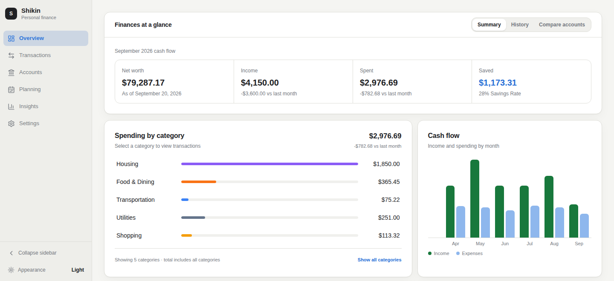
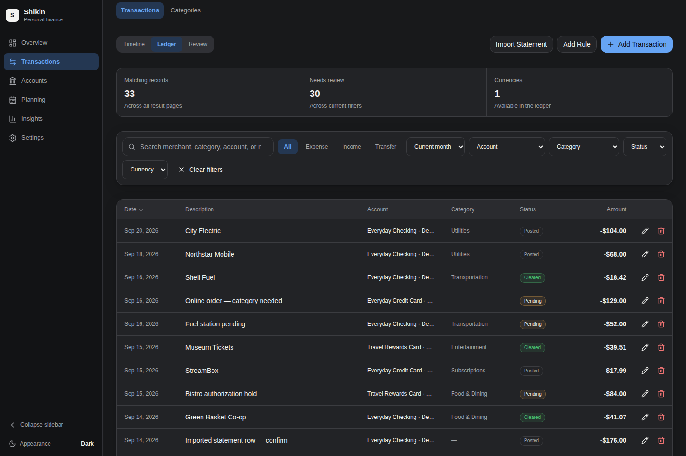

# Shikin


**Local-first personal finance for desktop and private web access.**

[](https://github.com/g0dxn4/Shikin/actions/workflows/ci.yml)
[](https://github.com/g0dxn4/Shikin/releases/latest)
[](LICENSE)

Shikin is a personal finance app you run yourself. Budgets, accounts, investments, and bills live in local SQLite — no mandatory cloud account. Use the desktop app, optional loopback web access, and optional CLI/MCP automation. There is no built-in chat assistant.

## See it





_Screenshots show synthetic demo data._

## Features

### Tracking

- Transactions with search, filters, splits, CSV import, and OFX/QFX/QIF statements
- Recurring rules for rent, pay, and utilities
- Accounts: checking, savings, credit card, cash, investment, crypto, and other

### Planning and insights

- Category budgets, savings goals, bills, bill calendar, debt payoff estimates, and receivables
- Overview, reports with PDF export, spending heatmap, net worth, and habit streaks
- Native light and dark appearance; English and Spanish

### Investments and currency

- Holdings with optional quotes from Alpha Vantage, CoinGecko, or Finnhub, plus manual prices
- Exchange rates via frankfurter.app from cached rates, with an online refresh (including automatic network refresh when rates are stale)
- Legacy holdings stay stored; they may need a verified price or valuation identity before converted totals appear

### Automation (optional)

- 108 shared CLI/MCP tools and 113 CLI commands on the same local database
- Imports, reconciliation, payments, buckets, backup, audit, and diagnostics
- `shikin tools --json` is the catalog (missing `effects` means unaudited, not read-only)
- Connect Claude Desktop, Cursor, or any MCP client — Shikin does not ship a chat UI

### Current limits

- Recurring transfer rules are not supported yet (one-off transfers work)
- Debt payoff infers card APR as 0% because accounts do not store APR
- Installment plans such as meses sin intereses are not first-class; record each installment as a recurring or monthly card transaction

## Install

Install a **released** desktop build from [GitHub Releases](https://github.com/g0dxn4/Shikin/releases/latest). Released packages do not need developer tools.

| Platform      | Assets                      |
| ------------- | --------------------------- |
| Linux (amd64) | `.deb`, `.rpm`, or AppImage |
| macOS         | `.dmg`                      |
| Windows       | `.msi` or setup `.exe`      |

**Linux helper** (amd64). Interactive by default: it recommends `.deb`, `.rpm`, or AppImage, then can install optional CLI/MCP support.

```bash
curl -fsSL https://raw.githubusercontent.com/g0dxn4/Shikin/main/scripts/install-linux.sh | sh
```

Native `.deb`/`.rpm` packages may need sudo; declining sudo falls back to AppImage. Other Linux architectures are not in the helper — use the release assets above or build from source. Advanced helper flags: [Linux desktop installer](cli/README.md#linux-desktop-installer).

**Optional CLI/MCP** (Linux and macOS), after the desktop app or later:

```bash
curl -fsSL https://raw.githubusercontent.com/g0dxn4/Shikin/main/scripts/install-cli.sh | sh
```

Best tested on **Node.js 24 LTS** with npm. `better-sqlite3@12.8` supports Node 20, 22, 23, 24, and 25. Portable AI skill installers and extra flags: [cli/README.md](cli/README.md).

Desktop builds check GitHub Releases and can install **signed updates** from Settings. Export a backup before you upgrade.

## Backup, restore, and upgrades

- Export a SQLite snapshot from **Settings → Data**. Restoring that database snapshot is validated first, and a rollback copy of the current database is taken before replacement. CSV and statement imports are not full-database snapshots and do not use this restore/rollback path.
- Keep app settings and filesystem notebooks separately when moving machines; a SQLite snapshot is not a full setup backup.
- CLI/MCP restore previews by default; applying a restore requires an explicit apply.
- Hosted web cannot restore the database — stop hosted access and restore from the desktop app.
- Legacy holdings stay in the database; they may need a verified price or valuation identity before converted totals appear. Records are not discarded.
- Import statements from **Transactions → Import Statement**. Maintain coverage and history from **Accounts → Maintain history**. Automation details: [Automation Workflows](docs/reference/AUTOMATION-WORKFLOWS.md).

## Privacy and network

Finance records are stored locally (SQLite under the platform app-data directory). There is no mandatory cloud account.

Shikin is not an offline-only app. Exchange rates use a local cache and can refresh over the network from frankfurter.app — including an automatic refresh on startup when cached rates are stale. Optional market quotes contact Alpha Vantage, CoinGecko, or Finnhub. Optional CLI/MCP clients and external AI tools follow their own privacy practices. Do not assume requests or data never leave the device.

`shikin web` serves the production app on **127.0.0.1** only. For private access from another machine on your tailnet:

```bash
shikin web --port 8480
# in another terminal
tailscale serve --bg http://127.0.0.1:8480
```

That is private tailnet access, not public SaaS. Do not use Tailscale Funnel. Keep the app running (or in the tray) while Settings → General → Hosted web access is on.

## Automation example

```bash
shikin list-accounts
shikin add-transaction --amount 12.50 --type expense --description "Lunch"
shikin finance-sanity-check --days-ahead 14 --redacted
shikin web --port 8480
shikin mcp
```

```json
{
  "mcpServers": {
    "shikin": {
      "command": "shikin",
      "args": ["mcp"]
    }
  }
}
```

`shikin tools --json` is the catalog. Missing `effects` means unaudited, not read-only. More: [cli/README.md](cli/README.md) and [Automation Workflows](docs/reference/AUTOMATION-WORKFLOWS.md).

## Development

Source work is best tested on **Node.js 24 LTS** and **pnpm 11.1.1**.

```bash
git clone https://github.com/g0dxn4/Shikin.git
cd Shikin
pnpm install
pnpm dev          # http://localhost:1420  (isolated temp DB by default)
```

Current development, CI, and releases use `main`. Create a feature branch from `main` and open the pull request against `main`. Install released versions rather than treating `main` as a stable install target. See [CONTRIBUTING.md](CONTRIBUTING.md) and [docs/guides/CONTRIBUTING.md](docs/guides/CONTRIBUTING.md).

## Docs

| Document                                                                    | Description                                |
| --------------------------------------------------------------------------- | ------------------------------------------ |
| [CLI and MCP](cli/README.md)                                                | Install, commands, hosted web, environment |
| [Backend map](docs/reference/BACKEND-MAP.md)                                | CLI, MCP, bridge, and local backend        |
| [Automation workflows](docs/reference/AUTOMATION-WORKFLOWS.md)              | Dry-run writes, provenance, smoke notes    |
| [Frontend map](docs/reference/FRONTEND-MAP.md)                              | Routes, stores, dialogs                    |
| [Database](docs/reference/DATABASE.md)                                      | SQLite schema and migrations               |
| [Contributing](docs/guides/CONTRIBUTING.md)                                 | Setup and conventions                      |
| [Support](SUPPORT.md) · [Security](SECURITY.md) · [Changelog](CHANGELOG.md) | Help, private reports, release notes       |

## License

[MIT](LICENSE) — Copyright (c) 2025 ASF
