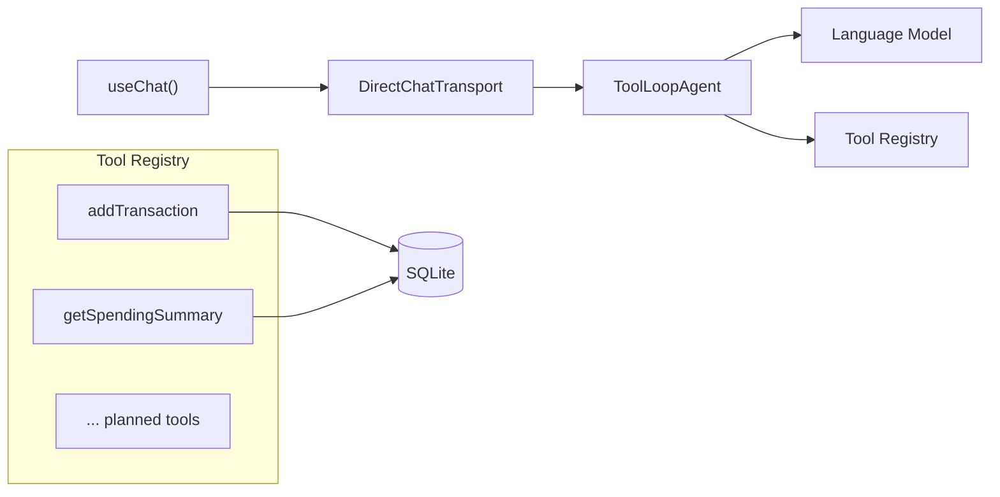
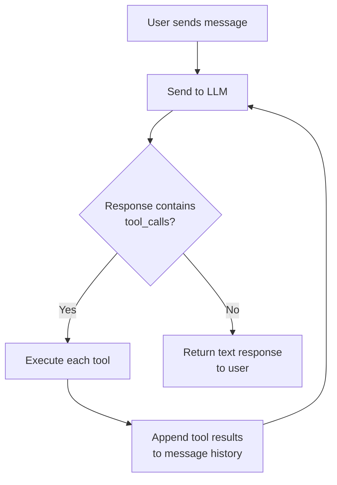

# AI Tools

This document describes the AI assistant (Val), its tool-calling architecture, all implemented and planned tools, the system prompt, and example conversations.

---

## Overview

Valute's AI assistant is named **Val**. It runs in the frontend using the AI SDK v6 `ToolLoopAgent`, which wraps a language model with a set of tools. When the user sends a message, the agent calls the LLM, and if the LLM responds with tool calls, the agent executes them locally (querying SQLite) and feeds the results back to the LLM until it produces a final text response.

This architecture means Val can perform multi-step operations in a single conversation turn without any custom orchestration code.

---

## Architecture

### Components



| Component | Import | Role |
|-----------|--------|------|
| `useChat` | `@ai-sdk/react` | React hook managing chat state, messages, and streaming |
| `DirectChatTransport` | `ai` | Connects the agent to `useChat` without an HTTP server |
| `ToolLoopAgent` | `ai` | Wraps a model with tools; automatically loops tool calls until the model produces text |
| `createAgent()` | `src/ai/agent.ts` | Factory function that creates a configured `ToolLoopAgent` |
| `createTransport()` | `src/ai/transport.ts` | Factory function that creates a `DirectChatTransport` wrapping an agent |

### Agent Configuration

```typescript
new ToolLoopAgent({
  model: languageModel,           // Provider-specific model instance
  tools: { addTransaction, getSpendingSummary },
  instructions: SYSTEM_PROMPT,    // Val's personality and guidelines
  maxOutputTokens: 2048,
  temperature: 0.7,
})
```

### Provider Support

| Provider | Config | Default Model | Notes |
|----------|--------|---------------|-------|
| OpenAI | API key required | `gpt-4o-mini` | Best balance of cost and capability |
| Anthropic | API key required | `claude-sonnet-4-20250514` | Strong reasoning for complex queries |
| Ollama | No key needed | `llama3.2` | Fully local, connects to `localhost:11434` |

The provider and model are configured in Settings and stored in `tauri-plugin-store`. The `useAIStore` Zustand store manages this state.

---

## System Prompt

Val's behavior is defined by the following system prompt:

```
You are Val, Valute's AI financial assistant. You help users manage their
personal finances.

Personality:
- Casual but competent -- you're a knowledgeable friend who happens to be
  great with money
- Bilingual -- respond in the same language the user writes in (English
  or Spanish)
- Confirm actions after completing them with a brief summary
- When uncertain, ask clarifying questions before taking action

Capabilities:
- Add transactions (expenses, income, transfers)
- Analyze spending patterns and provide summaries
- Answer questions about the user's financial data

Guidelines:
- All amounts are in the user's default currency unless specified
- Always confirm what you did after using a tool
- Be concise but helpful
- When the user mentions amounts, interpret them as the main currency unit
  (dollars, euros, etc.)
- If a date isn't specified, assume today
```

---

## Implemented Tools

### addTransaction

Adds a new financial transaction (expense, income, or transfer) to the database.

**File:** `src/ai/tools/add-transaction.ts`

**Zod Schema:**

```typescript
z.object({
  amount: z.number().positive()
    .describe('The transaction amount in the main currency unit (e.g. 12.50, not cents)'),
  type: z.enum(['expense', 'income', 'transfer'])
    .describe('The type of transaction'),
  description: z.string()
    .describe('A short description of the transaction'),
  category: z.string().optional()
    .describe('Category name (e.g. "Food & Dining", "Salary"). Will match the closest existing category.'),
  date: z.string().optional()
    .describe('Transaction date in YYYY-MM-DD format. Defaults to today.'),
  notes: z.string().optional()
    .describe('Additional notes about the transaction'),
})
```

**Behavior:**

1. Generates a ULID for the new transaction.
2. Converts the amount from dollars/euros/etc. to centavos using `toCentavos()`.
3. If a `category` name is provided, performs a fuzzy match (`LIKE '%name%'`) against the `categories` table.
4. Selects the first available account as the default (will be improved to accept an account parameter).
5. Inserts the transaction into the `transactions` table.
6. Updates the account balance (income adds, expense subtracts).
7. Returns a success/failure result with transaction details.

**Return type:**

```typescript
// Success
{
  success: true,
  transaction: {
    id: string,
    amount: number,
    type: 'expense' | 'income' | 'transfer',
    description: string,
    category: string,
    date: string,
  },
  message: string  // e.g., 'Added expense: $12.50 for "Lunch" on 2025-01-15'
}

// Failure (no accounts)
{
  success: false,
  message: 'No accounts found. Please create an account first.'
}
```

**Example conversation:**

```
User: I spent $45 on groceries

Val: [calls addTransaction({ amount: 45, type: "expense", description: "Groceries",
      category: "Food & Dining" })]

Val: Done! I logged a $45.00 expense for "Groceries" under Food & Dining, dated today.
```

---

### getSpendingSummary

Gets a breakdown of spending by category for a given time period.

**File:** `src/ai/tools/get-spending-summary.ts`

**Zod Schema:**

```typescript
z.object({
  period: z.enum(['week', 'month', 'year', 'custom'])
    .optional()
    .default('month')
    .describe('The time period to summarize'),
  startDate: z.string().optional()
    .describe('Start date (YYYY-MM-DD) for custom period'),
  endDate: z.string().optional()
    .describe('End date (YYYY-MM-DD) for custom period'),
})
```

**Behavior:**

1. Calculates the date range based on the `period` parameter:
   - `week` -- last 7 days
   - `month` -- first day of current month to today
   - `year` -- January 1st of current year to today
   - `custom` -- uses `startDate` and `endDate`
2. Queries total spending grouped by category name.
3. Queries total income for the same period.
4. Calculates net savings (income minus expenses).
5. Returns the breakdown with percentages.

**Return type:**

```typescript
{
  period: { start: string, end: string },
  totalExpenses: number,    // In main currency unit (e.g., 234.50)
  totalIncome: number,
  netSavings: number,
  byCategory: Array<{
    category: string,
    amount: number,
    transactionCount: number,
    percentage: number,     // Percentage of total expenses (0-100)
  }>,
  message: string,
}
```

**Example conversation:**

```
User: How much did I spend this month?

Val: [calls getSpendingSummary({ period: "month" })]

Val: This month you've spent $1,245.00 across 5 categories:
  - Food & Dining: $430.00 (34%)
  - Transportation: $280.00 (22%)
  - Entertainment: $210.00 (17%)
  - Shopping: $195.00 (16%)
  - Utilities: $130.00 (10%)

Your income was $3,500.00, leaving you with $2,255.00 in net savings. Nice work!
```

---

## Planned Tools

The following tools are planned for future implementation. Each will follow the same pattern: a Zod input schema, an `execute` function that queries SQLite, and a structured return type.

### getAccountBalances

**Purpose:** Return all account balances and a net worth summary.

```typescript
// Input: no parameters (or optional account type filter)
z.object({
  type: z.enum(['checking', 'savings', 'credit_card', 'cash',
                 'investment', 'crypto', 'other']).optional(),
})

// Output
{
  accounts: Array<{ name, type, balance, currency }>,
  totalAssets: number,
  totalLiabilities: number,  // credit card balances
  netWorth: number,
}
```

### getTransactionHistory

**Purpose:** List recent transactions with optional filters.

```typescript
z.object({
  limit: z.number().optional().default(20),
  accountName: z.string().optional(),
  category: z.string().optional(),
  type: z.enum(['expense', 'income', 'transfer']).optional(),
  startDate: z.string().optional(),
  endDate: z.string().optional(),
  search: z.string().optional(),  // description search
})
```

### editTransaction

**Purpose:** Modify an existing transaction.

```typescript
z.object({
  transactionId: z.string(),
  amount: z.number().positive().optional(),
  description: z.string().optional(),
  category: z.string().optional(),
  date: z.string().optional(),
  notes: z.string().optional(),
})
```

### deleteTransaction

**Purpose:** Delete a transaction by ID and reverse the account balance change.

```typescript
z.object({
  transactionId: z.string(),
  confirm: z.boolean().describe('Must be true to confirm deletion'),
})
```

### createBudget

**Purpose:** Create a new budget for a category.

```typescript
z.object({
  categoryName: z.string(),
  amount: z.number().positive(),
  period: z.enum(['weekly', 'monthly', 'yearly']),
  name: z.string().optional(),
})
```

### getBudgetStatus

**Purpose:** Check spending against budgets.

```typescript
z.object({
  categoryName: z.string().optional(),  // null = all budgets
})

// Output
{
  budgets: Array<{
    name, category, budgetAmount, spent, remaining, percentUsed
  }>,
}
```

### getInvestmentPerformance

**Purpose:** Return portfolio value, gains/losses, and per-holding breakdown.

```typescript
z.object({
  symbol: z.string().optional(),  // null = entire portfolio
})

// Output
{
  totalValue: number,
  totalCostBasis: number,
  totalGainLoss: number,
  totalGainLossPercent: number,
  holdings: Array<{
    symbol, name, shares, currentPrice, marketValue,
    costBasis, gainLoss, gainLossPercent
  }>,
}
```

### searchTransactions

**Purpose:** Full-text search across transaction descriptions and notes.

```typescript
z.object({
  query: z.string(),
  limit: z.number().optional().default(10),
})
```

### setReminder

**Purpose:** Create a reminder for a financial task (e.g., "pay rent on the 1st").

```typescript
z.object({
  message: z.string(),
  date: z.string(),
  recurring: z.enum(['once', 'daily', 'weekly', 'monthly']).optional(),
})
```

---

## Adding a New Tool

To add a new AI tool:

1. Create a file in `src/ai/tools/` (e.g., `get-account-balances.ts`).
2. Define the tool using the AI SDK's `tool()` function with a Zod schema and execute function:

```typescript
import { tool, zodSchema } from 'ai'
import { z } from 'zod'
import { query } from '@/lib/database'
import { fromCentavos } from '@/lib/money'

export const getAccountBalances = tool({
  description: 'Get all account balances and net worth summary.',
  inputSchema: zodSchema(
    z.object({
      type: z.enum(['checking', 'savings', 'credit_card', 'cash',
                     'investment', 'crypto', 'other']).optional()
        .describe('Filter by account type'),
    })
  ),
  execute: async ({ type }) => {
    const where = type ? `WHERE type = '${type}' AND is_archived = 0` : 'WHERE is_archived = 0'
    const accounts = await query<{ name: string; type: string; balance: number; currency: string }>(
      `SELECT name, type, balance, currency FROM accounts ${where}`
    )
    // ... compute totals, return result
  },
})
```

3. Export it from `src/ai/tools/index.ts`:

```typescript
export { getAccountBalances } from './get-account-balances'
```

4. Register it in the agent (`src/ai/agent.ts`):

```typescript
return new ToolLoopAgent({
  model: languageModel,
  tools: { addTransaction, getSpendingSummary, getAccountBalances },
  instructions: SYSTEM_PROMPT,
  // ...
})
```

---

## Tool Loop Architecture

The `ToolLoopAgent` handles the entire tool-calling loop automatically:



**Key behaviors:**

1. **Automatic looping** -- If the LLM calls a tool, the agent executes it and re-invokes the LLM with the result. This repeats until the LLM produces a text-only response.
2. **Multi-tool calls** -- The LLM can call multiple tools in a single response. The agent executes all of them before re-invoking the LLM.
3. **Error handling** -- If a tool throws an error, the error message is passed back to the LLM as the tool result, allowing the model to explain the failure to the user.
4. **No HTTP server** -- `DirectChatTransport` connects the agent directly to the `useChat` hook in-process. There is no local HTTP server for AI operations.
5. **Streaming** -- Responses are streamed token-by-token to the UI via the `useChat` hook's reactive state.

### Conversation Flow Example

```
User: "I got paid $3000 today. How's my spending this month?"

Turn 1 (LLM response):
  tool_calls: [
    { name: "addTransaction", args: { amount: 3000, type: "income", description: "Salary" } },
    { name: "getSpendingSummary", args: { period: "month" } }
  ]

Turn 2 (Tool results fed back):
  tool_results: [
    { name: "addTransaction", result: { success: true, message: "Added income: $3000.00..." } },
    { name: "getSpendingSummary", result: { totalExpenses: 1245.00, totalIncome: 3000.00, ... } }
  ]

Turn 3 (LLM final response):
  "Done! I've recorded your $3,000 salary. Here's your month so far:
   - Total income: $3,000.00
   - Total spending: $1,245.00
   - Net savings: $1,755.00
   Looking good -- you're keeping 58.5% of your income!"
```

---

## Val's Personality Guidelines

When contributing new tools or modifying the system prompt, keep these guidelines in mind:

1. **Casual but competent** -- Val is a friend who knows finance, not a corporate bank advisor. Use natural language, not formal jargon.
2. **Confirm actions** -- After every tool call that modifies data, Val summarizes what was done.
3. **Ask before assuming** -- If the user's intent is ambiguous (e.g., "transfer 500" but no accounts specified), Val asks for clarification.
4. **Bilingual** -- Val responds in the same language the user writes in. If the user writes in Spanish, Val responds in Spanish.
5. **Concise** -- Keep responses short. Use bullet points for lists. Do not repeat information the user already provided.
6. **Context-aware** -- Val can reference data from tool results to provide richer responses (e.g., mentioning budget remaining after adding an expense).
