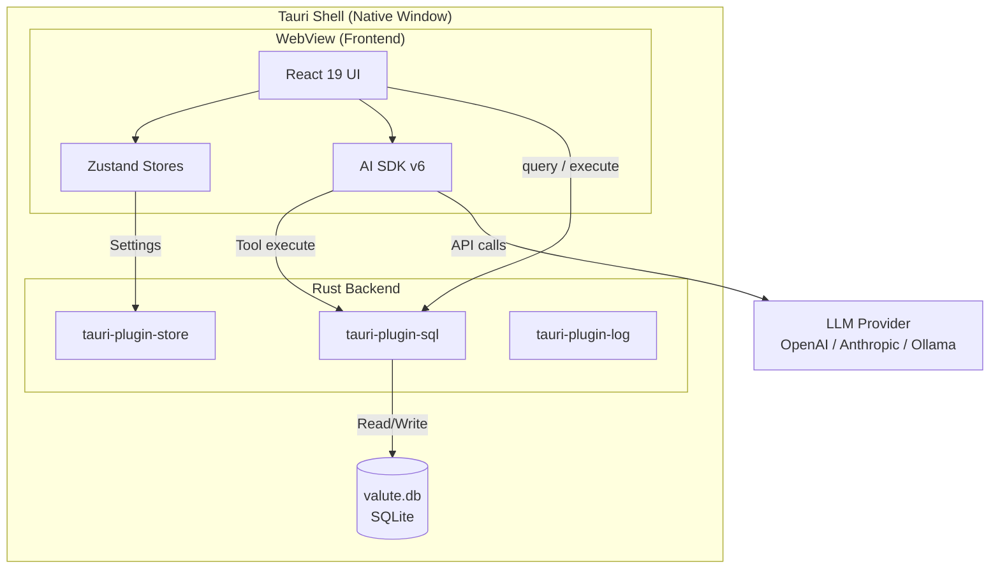
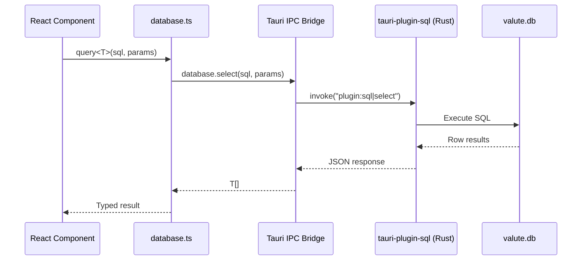
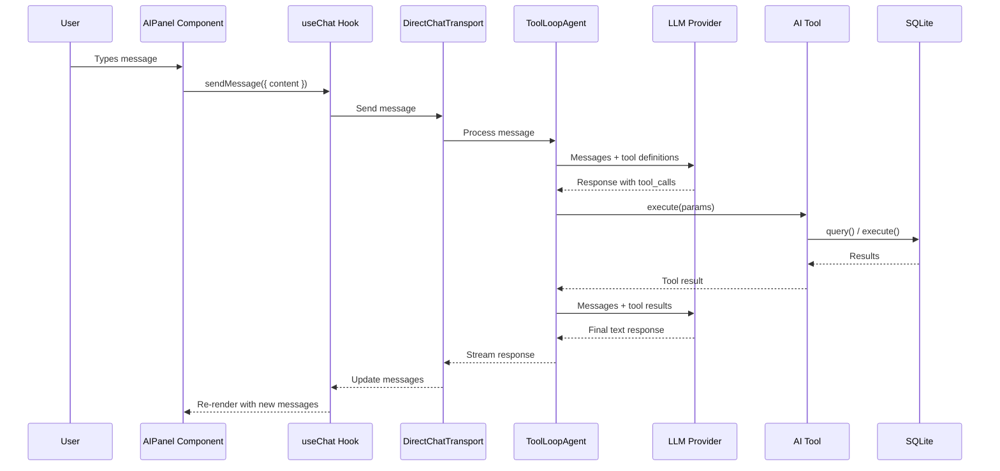
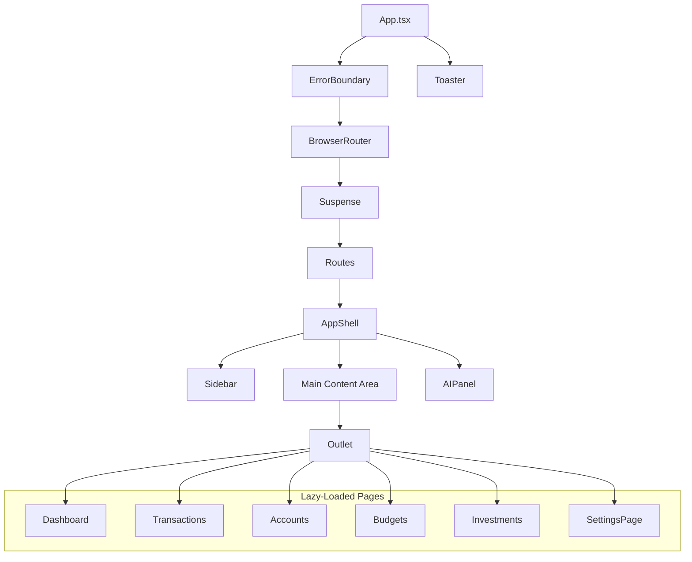
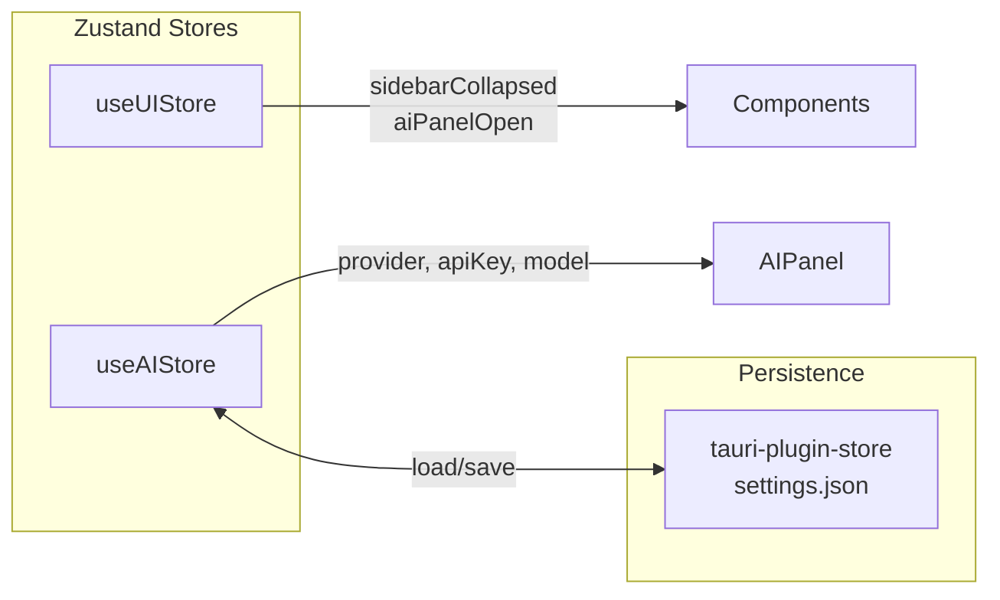

# Architecture

This document describes the system architecture of Valute, including the runtime layers, data flow, component hierarchy, state management, and extension points.

---

## High-Level Overview

Valute is a Tauri v2 desktop application. The frontend is a React 19 SPA rendered inside a native webview. The Rust backend handles SQLite database access through `tauri-plugin-sql`, which exposes SQL operations to the frontend via Tauri's IPC bridge. AI operations run entirely in the frontend using the AI SDK, calling LLM providers directly from the webview.



---

## Runtime Layers

### Layer 1: Tauri Shell (Rust)

The Rust backend (`src-tauri/`) is intentionally thin. It registers plugins and runs migrations at startup. There are no custom Tauri commands -- all database access goes through `tauri-plugin-sql`.

```
src-tauri/
├── src/
│   ├── main.rs          # Entry point, calls lib::run()
│   └── lib.rs           # Plugin registration, migration loading
├── migrations/
│   └── 001_core_tables.sql   # Initial schema
├── Cargo.toml           # Rust dependencies
└── tauri.conf.json      # Window config, CSP, bundle settings
```

**Plugins registered at startup:**

| Plugin | Purpose |
|--------|---------|
| `tauri-plugin-sql` | SQLite database with migration support |
| `tauri-plugin-store` | Encrypted key-value store for API keys |
| `tauri-plugin-log` | Structured logging (debug builds only) |

### Layer 2: Frontend (React + TypeScript)

The frontend (`src/`) handles all UI rendering, AI orchestration, and business logic. It communicates with SQLite through the `@tauri-apps/plugin-sql` JavaScript bindings, which internally use Tauri IPC.

### Layer 3: AI (AI SDK v6)

The AI layer runs in the frontend process. It uses the AI SDK's `ToolLoopAgent` and `DirectChatTransport` to manage conversations with tool calling. When a tool is invoked by the LLM, the tool's `execute` function runs in the frontend and queries SQLite directly.

---

## Tauri IPC Flow

Every database operation follows this path:



The `database.ts` module provides two functions that wrap the plugin:

- `query<T>(sql, params)` -- for SELECT statements, returns `T[]`
- `execute(sql, params)` -- for INSERT/UPDATE/DELETE, returns `{ rowsAffected, lastInsertId }`

The database connection is lazy-loaded as a singleton (`Database.load('sqlite:valute.db')`).

---

## AI Tool Flow

When the user sends a message in the AI panel, the following sequence occurs:



**Key classes:**

| Class | Source | Role |
|-------|--------|------|
| `ToolLoopAgent` | AI SDK v6 | Wraps a model with tools and handles the tool-call loop automatically |
| `DirectChatTransport` | AI SDK v6 | Connects the agent to the `useChat` hook without an HTTP server |
| `useChat` | @ai-sdk/react | React hook for chat state, message history, and streaming |

The `ToolLoopAgent` automatically re-invokes the LLM after each tool result until the model produces a final text response (no more tool calls). This means multi-step operations (e.g., "add a transaction and then show me my spending") work without extra orchestration code.

---

## Component Hierarchy



### Layout Structure

The `AppShell` component creates a three-column layout:

```
┌──────────┬──────────────────────────────┬────────────┐
│          │                              │            │
│ Sidebar  │       Main Content           │  AI Panel  │
│  240px   │       (flex-1)               │   400px    │
│          │                              │ (toggle)   │
│  - Nav   │    <Outlet /> renders        │            │
│  - AI    │    the active page           │  - Chat    │
│  - Cfg   │                              │  - Tools   │
│          │                              │            │
└──────────┴──────────────────────────────┴────────────┘
```

- **Sidebar** -- Collapsible (240px / 60px). Navigation links, AI toggle button, settings link.
- **Main Content** -- Fills remaining space. Renders the active route via `<Outlet />`.
- **AI Panel** -- Slides in from the right (400px). Contains the chat interface with Val.

All pages are lazy-loaded with `React.lazy()` and wrapped in `<Suspense>` for code splitting.

---

## State Management

Valute uses Zustand for global state. Each store is a standalone module in `src/stores/`.

### Store Architecture



### useUIStore

Manages transient UI state. Not persisted across sessions.

| Field | Type | Description |
|-------|------|-------------|
| `sidebarCollapsed` | `boolean` | Whether the sidebar is collapsed |
| `aiPanelOpen` | `boolean` | Whether the AI panel is visible |
| `toggleSidebar()` | action | Toggle sidebar collapse |
| `toggleAIPanel()` | action | Toggle AI panel visibility |
| `setAIPanelOpen(open)` | action | Set AI panel state directly |

### useAIStore

Manages AI provider configuration. Persisted to `tauri-plugin-store` (encrypted local file).

| Field | Type | Description |
|-------|------|-------------|
| `provider` | `string` | Selected provider (`openai`, `anthropic`, `ollama`) |
| `apiKey` | `string` | API key for the provider |
| `model` | `string` | Selected model name |
| `isConfigured` | `boolean` | Whether a valid API key is set |
| `loadSettings()` | async action | Load settings from tauri-plugin-store |
| `saveSettings(...)` | async action | Persist settings to tauri-plugin-store |

---

## Data Flow Summary

| Operation | Path |
|-----------|------|
| Read financial data | Component -> `query<T>()` -> tauri-plugin-sql -> SQLite |
| Write financial data | Component -> `execute()` -> tauri-plugin-sql -> SQLite |
| AI conversation | AIPanel -> `useChat` -> `DirectChatTransport` -> `ToolLoopAgent` -> LLM API |
| AI tool execution | `ToolLoopAgent` -> tool.execute() -> `query()`/`execute()` -> SQLite |
| UI state | Component -> `useUIStore` (Zustand, in-memory) |
| AI settings | Component -> `useAIStore` -> tauri-plugin-store (local file) |
| Notifications | Any component -> `sonner` toast |

---

## Security Model

### Content Security Policy

The Tauri CSP restricts the webview to only connect to known AI provider endpoints:

```
default-src 'self';
script-src 'self';
style-src 'self' 'unsafe-inline';
img-src 'self' data: blob:;
font-src 'self';
connect-src 'self'
  https://api.openai.com
  https://api.anthropic.com
  http://localhost:11434;
```

### API Key Storage

API keys are stored in `tauri-plugin-store` (`settings.json`), which is a local encrypted file managed by Tauri. Keys never leave the device except when sent directly to the configured LLM provider.

### Database

The SQLite database (`valute.db`) is stored in the Tauri app data directory. There is no network access to the database. All queries run locally through Tauri IPC.

---

## Extension Hook Points (Planned)

The following extension points are designed for the future extension system:

| Hook | Trigger | Data Available |
|------|---------|----------------|
| `beforeTransaction` | Before a transaction is inserted | Transaction data (can modify or reject) |
| `afterTransaction` | After a transaction is committed | Transaction record |
| `onDashboardLoad` | When dashboard page mounts | Current account summaries |
| `onBudgetCheck` | When a budget is evaluated | Budget + spending data |
| `onAIMessage` | When an AI message is received | Message content, tool calls |
| `onSettingsRender` | When settings page renders | Current settings |
| `registerTool` | At extension load time | Adds a tool to the AI agent |
| `registerWidget` | At extension load time | Adds a dashboard widget |
| `registerRoute` | At extension load time | Adds a navigation route |

Extensions will have access to the database through a sandboxed API with permission-based access control. See [EXTENSIONS.md](../reference/EXTENSIONS.md) for the full design.

---

## Build and Bundle

### Development

```
pnpm start
  ├── Vite dev server (port 1420) -- serves React app with HMR
  └── Tauri dev -- opens native window pointing to Vite server
```

### Production

```
pnpm build:tauri
  ├── vite build -- optimized frontend bundle
  │   └── Manual chunks: vendor-react, vendor-ui, vendor-forms, vendor-utils
  └── tauri build -- compiles Rust backend + bundles into native installer
      └── Output: .dmg (macOS), .msi (Windows), .deb/.AppImage (Linux)
```

### Bundle Targets

The `tauri.conf.json` sets `"targets": "all"`, which produces installers for all supported platforms on the build machine. The application category is `Finance`.
