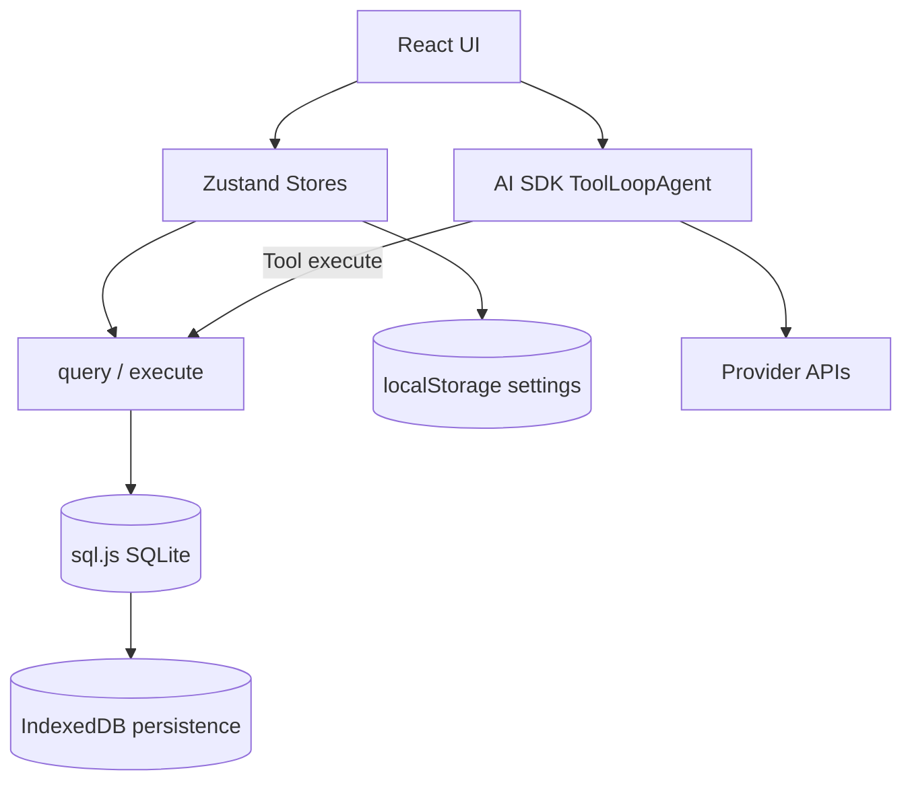
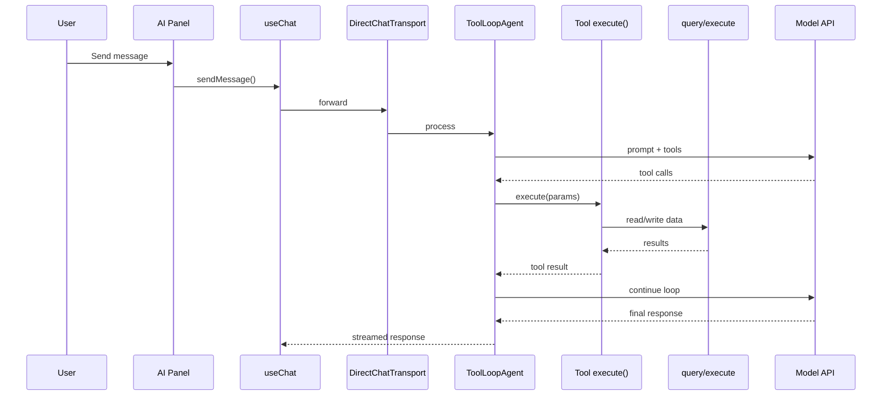

# Architecture

This document describes Valute's current browser-first architecture: runtime layers, data flow, state boundaries, and major modules.

---

## High-Level Overview

Valute runs as a React SPA in the browser. Data remains local by combining:

- **SQLite in memory (`sql.js`)** for relational querying.
- **IndexedDB** for persistent database snapshots.
- **`localStorage`** for app settings and preferences.

AI flows run in the same frontend process using the AI SDK tool loop. Tool executions read/write the local database through shared `query`/`execute` utilities.

---

## Runtime Layers

### Layer 1: UI and Routing

- `src/App.tsx` sets up routing, app shell, and lazy-loaded pages.
- `src/components/layout/` provides shared frame components (sidebar, main content, AI panel).
- `src/pages/` hosts route-level features (dashboard, transactions, accounts, budgets, investments, settings).

### Layer 2: State and Domain Logic

- Zustand stores under `src/stores/` isolate feature state.
- Stores call shared domain utilities in `src/lib/`.
- Data mutations and reads are centralized around database helper functions.

### Layer 3: Local Persistence

- `src/lib/database.ts` initializes `sql.js`, applies migrations, and persists snapshots to IndexedDB.
- `src/lib/storage.ts` provides an async store interface backed by `localStorage`.
- `src/lib/virtual-fs.ts` offers browser-safe filesystem compatibility used by extension/runtime paths.

### Layer 4: AI Orchestration

- `src/ai/agent.ts` configures `ToolLoopAgent` with model + tools.
- `src/ai/transport.ts` wires agent to `useChat` with `DirectChatTransport`.
- `src/ai/tools/` contains tool implementations that operate on local financial data.

---

## Database Lifecycle

The database lifecycle is fully client-side:

1. Load SQL.js wasm runtime.
2. Restore previous DB snapshot from IndexedDB if available.
3. Run schema migrations (`MIGRATION_001`, `MIGRATION_002`, and incremental updates).
4. Serve all queries through `query<T>()` and `execute()`.
5. Persist to IndexedDB after write operations.

This model keeps startup simple and supports offline-first behavior while retaining SQL expressiveness.

---

## AI Tool Flow

The loop continues until the model emits normal text with no remaining tool calls.

---

## State Boundaries

- `ui-store`: panel state, layout toggles, and global UI controls.
- `ai-store`: provider settings, model config, and AI-session preferences.
- feature stores (accounts, transactions, etc.): feature-level CRUD and list state.

Each store owns one concern and relies on shared library helpers for persistence or computations.

---

## Security and Privacy Model

- All financial records are stored locally in IndexedDB-backed SQLite snapshots.
- API keys stay local in browser storage and are only used for direct provider requests.
- No mandatory backend service is required for core product functionality.

Threat model note: because this is browser runtime storage, local machine/browser profile security determines at-rest protection.

---

## Current Constraints

- Database persistence is browser-profile scoped (not a shared system DB file).
- Large write-heavy workloads may incur snapshot overhead due to full DB export on writes.
- Some legacy Tauri artifacts remain in the repository (`src-tauri/`, Tauri scripts) but are not part of the primary runtime path.

---

## Near-Term Architecture Priorities

- Incremental persistence optimizations for large datasets.
- Better observability around AI tool execution and storage operations.
- Cleaner separation between legacy desktop-shell support and browser-first runtime modules.
