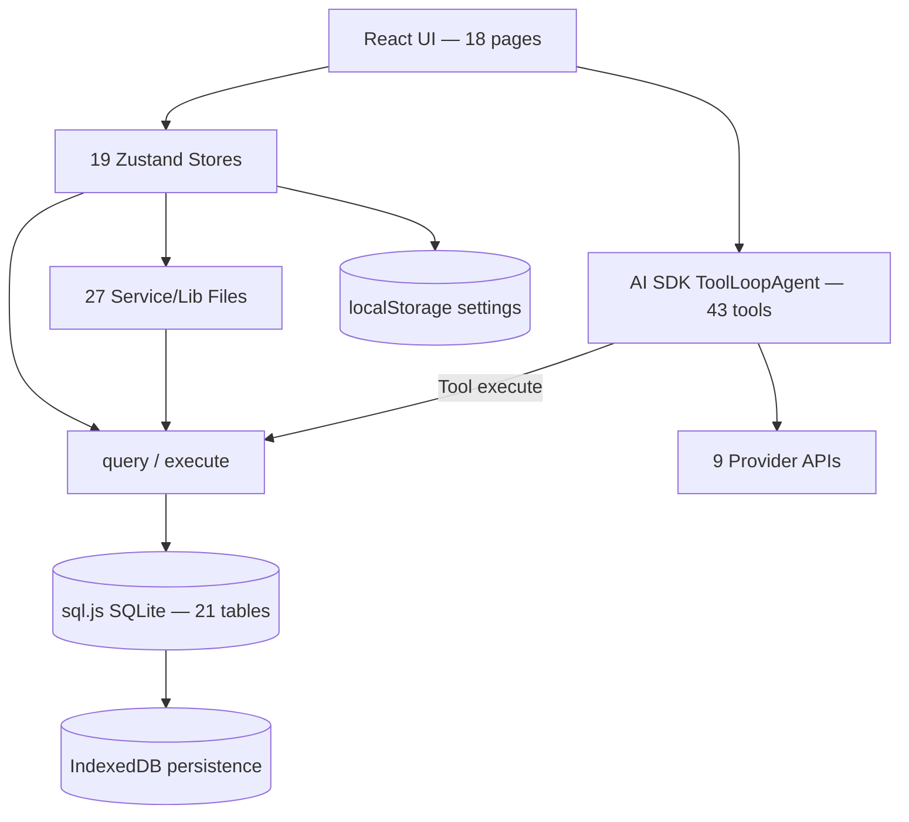
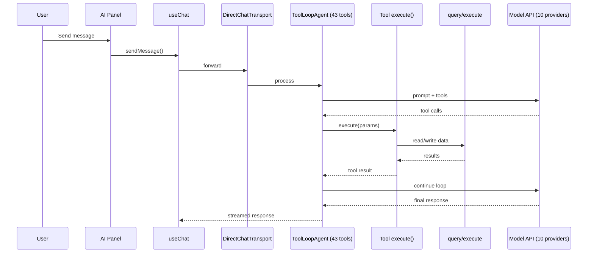

# Architecture

> Historical note: this document describes an earlier browser-first architecture with `sql.js` + IndexedDB and an embedded frontend AI agent.
> For the current implementation, start with `docs/reference/BACKEND-MAP.md` and `docs/reference/FRONTEND-MAP.md`.

This document describes Shikin's browser-first architecture: runtime layers, data flow, state boundaries, and major modules.

---

## High-Level Overview

Shikin runs as a React SPA in the browser. Data remains local by combining:

- **SQLite in memory (`sql.js`)** for relational querying (21 tables).
- **IndexedDB** for persistent database snapshots.
- **`localStorage`** for app settings, preferences, achievements, and health score history.

AI flows run in the same frontend process using the AI SDK tool loop. Tool executions read/write the local database through shared `query`/`execute` utilities.

---

## Runtime Layers

### Layer 1: UI and Routing

- `src/App.tsx` sets up routing, app shell, and lazy-loaded pages.
- `src/components/layout/` provides shared frame components (sidebar, bottom nav, AI panel).
- `src/pages/` hosts 18 page files with 12 routed pages:

| Route            | Page          | Description                                      |
| ---------------- | ------------- | ------------------------------------------------ |
| `/`              | Dashboard     | Overview with charts, alerts, health score, tips |
| `/transactions`  | Transactions  | Tabbed list (transactions + recurring), import   |
| `/accounts`      | Accounts      | Account management with credit card tracking     |
| `/budgets`       | Budgets       | Budget creation and progress monitoring          |
| `/goals`         | Goals         | Savings goals with progress rings                |
| `/investments`   | Investments   | Portfolio with price charts and allocation       |
| `/subscriptions` | Subscriptions | Recurring service tracking                       |
| `/debt-payoff`   | Debt Payoff   | Snowball vs avalanche planner with charts        |
| `/forecast`      | Forecast      | Cash flow projections (30/60/90 day)             |
| `/notebook`      | Notebook      | Markdown notes and portfolio reviews             |
| `/reports`       | Reports       | Monthly/annual reports with PDF export           |
| `/settings`      | Settings      | AI provider, currency, category rules, data      |

Additional unrouted pages: onboarding, net-worth, spending-heatmap, ai-insights, category-management, bill-calendar.

### Layer 2: State and Domain Logic

19 Zustand stores under `src/stores/` isolate feature state:

| Store                  | Purpose                                           |
| ---------------------- | ------------------------------------------------- |
| `transaction-store`    | Transaction CRUD, split tracking, auto-categorize |
| `account-store`        | Account CRUD, balance management                  |
| `budget-store`         | Budget tracking with period calculations          |
| `category-store`       | Category management                               |
| `goal-store`           | Savings goals with progress computation           |
| `investment-store`     | Investment CRUD, portfolio summary, price history |
| `subscription-store`   | Subscription tracking                             |
| `recurring-store`      | Recurring rules, materialization on startup       |
| `debt-store`           | Debt payoff calculations                          |
| `forecast-store`       | Cash flow forecast generation                     |
| `anomaly-store`        | Anomaly scanning and dismissals                   |
| `health-store`         | Financial health score with localStorage history  |
| `recap-store`          | Spending recap generation and history             |
| `categorization-store` | Auto-categorization rule management               |
| `currency-store`       | Exchange rates, preferred currency                |
| `achievement-store`    | Streaks and badge tracking                        |
| `report-store`         | Report generation and PDF/CSV export              |
| `ai-store`             | Provider settings, model config, OAuth            |
| `conversation-store`   | Chat history persistence                          |
| `ui-store`             | Panel/dialog state, layout toggles                |

### Layer 3: Services and Utilities

27 service files under `src/lib/` provide domain logic:

| Service                    | Purpose                                               |
| -------------------------- | ----------------------------------------------------- |
| `database.ts`              | sql.js init, 10 migrations, query/execute, IndexedDB  |
| `anomaly-service.ts`       | 5 anomaly detection algorithms                        |
| `forecast-service.ts`      | Cash flow projection with confidence intervals        |
| `health-score-service.ts`  | 5-dimension composite health score                    |
| `recap-service.ts`         | Weekly/monthly natural language summaries             |
| `debt-service.ts`          | Snowball/avalanche payoff calculations                |
| `education-service.ts`     | 15 financial education tips across 5 topics           |
| `auto-categorize.ts`       | 3-tier category suggestion (exact/partial/historical) |
| `split-service.ts`         | Transaction split management                          |
| `statement-parser.ts`      | OFX/QFX/QIF bank statement parsing                    |
| `statement-import.ts`      | Statement import with duplicate detection             |
| `exchange-rate-service.ts` | frankfurter.app rate fetching                         |
| `report-service.ts`        | Monthly/annual report aggregation                     |
| `pdf-generator.ts`         | Dark-themed PDF generation via jsPDF                  |
| `achievement-service.ts`   | 8 achievements + streak tracking                      |
| `price-service.ts`         | Alpha Vantage (stocks) + CoinGecko (crypto)           |
| `notebook.ts`              | Markdown note filesystem operations                   |
| `news-service.ts`          | Finnhub + NewsAPI financial news                      |
| `money.ts`                 | toCentavos/fromCentavos/formatMoney                   |

### Layer 4: Local Persistence

- `src/lib/database.ts` initializes `sql.js`, applies 10 migrations, and persists snapshots to IndexedDB.
- `src/lib/storage.ts` provides an async store interface backed by `localStorage`.
- `src/lib/virtual-fs.ts` offers browser-safe filesystem compatibility.

### Layer 5: AI Orchestration

- `src/ai/agent.ts` configures `ToolLoopAgent` with model + 43 tools + system prompt.
- `src/ai/transport.ts` wires agent to `useChat` with `DirectChatTransport`.
- `src/ai/tools/` contains 43 tool implementations organized across 14 categories.
- `src/ai/memory-loader.ts` loads MemGPT-style persistent memories into the system prompt.

---

## Database Lifecycle

1. Load SQL.js wasm runtime.
2. Restore previous DB snapshot from IndexedDB if available.
3. Run 10 schema migrations (`001_core_tables` through `010_transaction_splits`).
4. Serve all queries through `query<T>()` and `execute()`.
5. Persist to IndexedDB after write operations.
6. On startup, materialize recurring transactions and auto-refresh exchange rates if stale.

---

## AI Tool Flow

---

## Dashboard Architecture

The dashboard aggregates data from 7 stores and displays:

1. **Metric Cards**: Total balance, monthly income/expenses, savings rate
2. **Charts**: 6-month spending trend (AreaChart), category breakdown (PieChart)
3. **Alerts**: Anomaly detection results (5 detection types)
4. **Cash Flow Forecast**: 30/60/90 day projected balance chart
5. **Financial Health Score**: SVG gauge with sub-score breakdown
6. **Spending Recap**: Weekly natural language summary with highlight chips
7. **Goals Preview**: Top 3 savings goals with SVG progress rings
8. **Streaks**: Current logging streak badge
9. **Achievements**: Newly unlocked badge notifications
10. **Education Tip**: Daily rotating financial concept
11. **Accounts Preview**: Top 3 account balances
12. **Quick Actions**: Add transaction, ask Ivy

---

## Security and Privacy Model

- All financial records are stored locally in IndexedDB-backed SQLite snapshots.
- API keys stay local in browser storage and are only used for direct provider requests.
- No mandatory backend service is required for core product functionality.
- Exchange rates are fetched from a free public API (frankfurter.app) — no user data is sent.

---

## Design System (ASF)

| Element    | Value                              |
| ---------- | ---------------------------------- |
| Background | `#020202`                          |
| Surface    | `#0a0a0a`                          |
| Accent     | `#bf5af2`                          |
| Headings   | Space Grotesk                      |
| Body       | Outfit                             |
| Mono       | Space Mono                         |
| Buttons    | 0px radius (brutalist)             |
| Badges     | 9999px radius (pill)               |
| Cards      | 12px radius, glass morphism        |
| Glass      | rgba(10,10,10,0.6) + blur(12px)    |
| Mode       | Forced dark (no light/dark toggle) |
