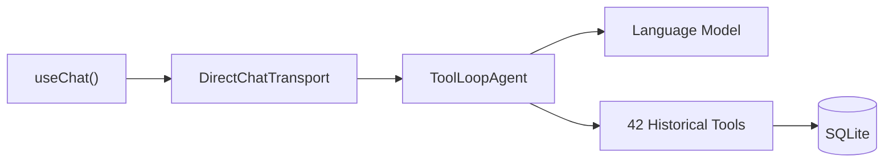

# AI Tools

> Historical note: this document describes an earlier frontend AI-agent design that is no longer the current repo architecture.
> The legacy design notes here reference the CLI/MCP surface as a 42-tool set. The current shared catalog ships 44 tool definitions, including 2 structured unavailable placeholders for external-feed news/congressional tools.

This historical document described Ivy as a frontend AI financial assistant with 42 implemented tools, a system prompt, and provider support, while the current shared CLI/MCP catalog ships 44 tool definitions including 2 compatibility placeholders.

---

## Architecture

Ivy runs in the frontend using AI SDK v6's `ToolLoopAgent`. When the user sends a message, the agent calls the LLM. If the LLM responds with tool calls, the agent executes them locally (querying SQLite) and feeds results back until a final text response is produced.

| Component             | Import                | Role                                                   |
| --------------------- | --------------------- | ------------------------------------------------------ |
| `useChat`             | `@ai-sdk/react`       | React hook managing chat state and streaming           |
| `DirectChatTransport` | `ai`                  | Connects agent to `useChat` without HTTP server        |
| `ToolLoopAgent`       | `ai`                  | Wraps model with tools; auto-loops until text response |
| `createAgent()`       | `src/ai/agent.ts`     | Factory that creates a configured `ToolLoopAgent`      |
| `createTransport()`   | `src/ai/transport.ts` | Factory that creates a `DirectChatTransport`           |

---

## Provider Support (9 Providers)

| Provider   | Auth            | Default Model              | Notes                         |
| ---------- | --------------- | -------------------------- | ----------------------------- |
| OpenAI     | API key / OAuth | `gpt-4o-mini`              | Best cost/capability balance  |
| Anthropic  | API key         | `claude-sonnet-4-20250514` | Strong reasoning              |
| Google     | API key / OAuth | `gemini-2.0-flash`         | Gemini models                 |
| Mistral    | API key         | `mistral-large-latest`     | European provider             |
| xAI        | API key         | `grok-2`                   | Grok models                   |
| Groq       | API key         | `llama-3.3-70b-versatile`  | Fast inference                |
| DeepSeek   | API key         | `deepseek-chat`            | Cost-effective                |
| OpenRouter | API key         | Dynamic model fetching     | Unified proxy for 100+ models |
| Ollama     | None            | `llama3.2`                 | Fully local, localhost:11434  |

---

## All 42 Historical Tools

### Transaction Tools (5)

| Tool                | File                    | Description                                    |
| ------------------- | ----------------------- | ---------------------------------------------- |
| `addTransaction`    | `add-transaction.ts`    | Add expense, income, or transfer               |
| `updateTransaction` | `update-transaction.ts` | Modify an existing transaction                 |
| `deleteTransaction` | `delete-transaction.ts` | Delete transaction and reverse balance change  |
| `queryTransactions` | `query-transactions.ts` | Search/filter with date, category, account     |
| `splitTransaction`  | `split-transaction.ts`  | Split a transaction across multiple categories |

### Account Tools (4)

| Tool            | File                | Description                     |
| --------------- | ------------------- | ------------------------------- |
| `listAccounts`  | `list-accounts.ts`  | List all accounts with balances |
| `createAccount` | `create-account.ts` | Create a new account            |
| `updateAccount` | `update-account.ts` | Modify account details          |
| `deleteAccount` | `delete-account.ts` | Delete an account               |

### Category Tools (1)

| Tool             | File                 | Description         |
| ---------------- | -------------------- | ------------------- |
| `listCategories` | `list-categories.ts` | List all categories |

### Analytics Tools (6)

| Tool                    | File                         | Description                                 |
| ----------------------- | ---------------------------- | ------------------------------------------- |
| `getSpendingSummary`    | `get-spending-summary.ts`    | Spending breakdown by category for a period |
| `getBalanceOverview`    | `get-balance-overview.ts`    | Account balances and net worth              |
| `analyzeSpendingTrends` | `analyze-spending-trends.ts` | Month-over-month spending trend analysis    |
| `getCreditCardStatus`   | `get-credit-card-status.ts`  | Credit card utilization and payment info    |
| `getNetWorth`           | `get-net-worth.ts`           | Total assets minus liabilities              |
| `getUpcomingBills`      | `get-upcoming-bills.ts`      | Bills due from subscriptions and recurring  |

### Budget Tools (3)

| Tool              | File                   | Description                     |
| ----------------- | ---------------------- | ------------------------------- |
| `createBudget`    | `create-budget.ts`     | Create a budget for a category  |
| `getBudgetStatus` | `get-budget-status.ts` | Check spending vs budget limits |
| `deleteBudget`    | `delete-budget.ts`     | Remove a budget                 |

### Goal Tools (3)

| Tool            | File                 | Description                                |
| --------------- | -------------------- | ------------------------------------------ |
| `createGoal`    | `create-goal.ts`     | Create a savings goal with target/deadline |
| `updateGoal`    | `update-goal.ts`     | Add/withdraw amounts, modify target        |
| `getGoalStatus` | `get-goal-status.ts` | All goals with progress and projections    |

### Subscription Tools (2)

| Tool                      | File                           | Description                |
| ------------------------- | ------------------------------ | -------------------------- |
| `listSubscriptions`       | `list-subscriptions.ts`        | List all subscriptions     |
| `getSubscriptionSpending` | `get-subscription-spending.ts` | Monthly subscription costs |

### Investment Tools (1)

| Tool               | File                   | Description                             |
| ------------------ | ---------------------- | --------------------------------------- |
| `manageInvestment` | `manage-investment.ts` | Add, update, delete investment holdings |

### Recurring Tools (2)

| Tool                         | File                  | Description                                |
| ---------------------------- | --------------------- | ------------------------------------------ |
| `manageRecurringTransaction` | `manage-recurring.ts` | CRUD + toggle for recurring rules          |
| `materializeRecurring`       | `manage-recurring.ts` | Manually trigger recurring materialization |

### Memory Tools (3)

| Tool             | File                 | Description                                   |
| ---------------- | -------------------- | --------------------------------------------- |
| `saveMemory`     | `save-memory.ts`     | Store user preference, fact, goal, or context |
| `recallMemories` | `recall-memories.ts` | Search memories by query                      |
| `forgetMemory`   | `forget-memory.ts`   | Delete a specific memory                      |

### Notebook Tools (3)

| Tool            | File                | Description                    |
| --------------- | ------------------- | ------------------------------ |
| `writeNotebook` | `write-notebook.ts` | Create/update a markdown note  |
| `readNotebook`  | `read-notebook.ts`  | Read a note by path            |
| `listNotebook`  | `list-notebook.ts`  | List all notes in the notebook |

### Intelligence Tools (1)

| Tool                      | File                           | Description                          |
| ------------------------- | ------------------------------ | ------------------------------------ |
| `generatePortfolioReview` | `generate-portfolio-review.ts` | Weekly portfolio performance summary |

### Advanced Analytics Tools (7)

| Tool                      | File                            | Description                                |
| ------------------------- | ------------------------------- | ------------------------------------------ |
| `manageCategoryRules`     | `manage-category-rules.ts`      | CRUD for auto-categorization rules         |
| `getSpendingAnomalies`    | `get-spending-anomalies.ts`     | Detect unusual charges, duplicates, spikes |
| `getForecastedCashFlow`   | `get-forecasted-cash-flow.ts`   | 30/60/90 day balance projections           |
| `getFinancialHealthScore` | `get-financial-health-score.ts` | Composite 0-100 health score with tips     |
| `getSpendingRecap`        | `get-spending-recap.ts`         | Weekly/monthly natural language recap      |
| `getDebtPayoffPlan`       | `get-debt-payoff-plan.ts`       | Snowball vs avalanche payoff strategies    |
| `generateReport`          | `generate-report.ts`            | Monthly/annual report summary              |

### Utility Tools (2)

| Tool              | File                   | Description                                      |
| ----------------- | ---------------------- | ------------------------------------------------ |
| `convertCurrency` | `convert-currency.ts`  | Convert between currencies (cached stored rates) |
| `getEducationTip` | `get-education-tip.ts` | Contextual financial education tips              |

---

## Adding a New Tool

For the current implementation, see `docs/guides/CONTRIBUTING.md#adding-a-new-cli-or-mcp-tool` and add tools through `cli/src/tools.ts`.

---

## Ivy's Personality

- **Casual but competent** — a knowledgeable friend, not a corporate advisor.
- **Bilingual** — responds in the user's language (English or Spanish).
- **Confirms actions** — brief summary after every data modification.
- **Asks before assuming** — clarifies ambiguous requests.
- **Educator, not advisor** — frames financial info as educational, not personalized advice.
- **Memory-aware** — references saved preferences and context across conversations.
