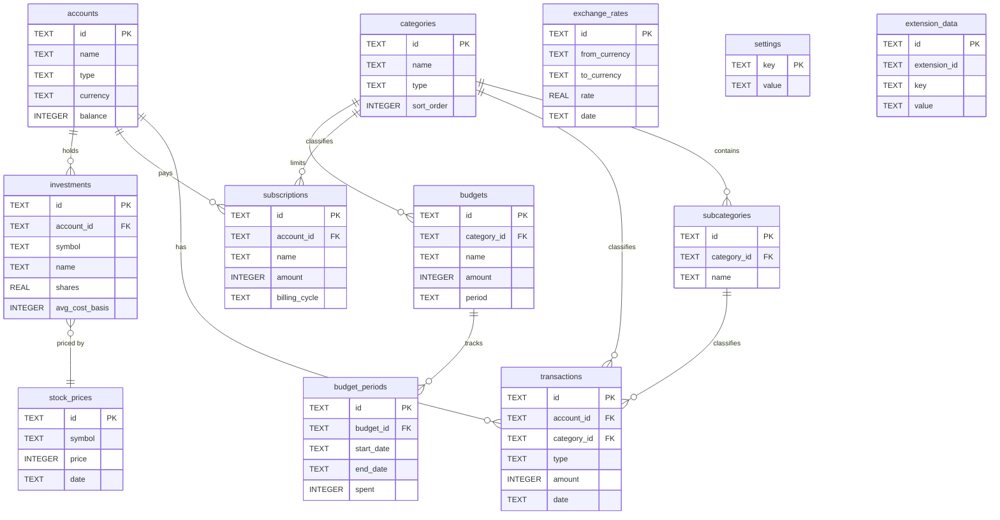

# Database Schema

This document describes the complete SQLite schema for Shikin, including all tables, columns, indexes, conventions, migration strategy, and example queries.

The schema is shared across the current dual-backend runtime: Tauri desktop uses `@tauri-apps/plugin-sql`, while browser mode reads and writes through the local data-server bridge against the shared SQLite database.

---

## Conventions

All tables follow these conventions consistently:

| Convention       | Rule                              | Rationale                                                                                                                         |
| ---------------- | --------------------------------- | --------------------------------------------------------------------------------------------------------------------------------- |
| **Money**        | `INTEGER` (centavos/cents)        | Avoids floating-point precision errors. `$12.50` is stored as `1250`.                                                             |
| **IDs**          | `TEXT` (ULIDs)                    | Sortable, unique, no auto-increment conflicts. Generated with `ulidx`.                                                            |
| **Dates**        | `TEXT` (ISO 8601)                 | `YYYY-MM-DD` for dates, `YYYY-MM-DDTHH:MM:SS.sssZ` for timestamps. SQLite has no native date type; text is portable and sortable. |
| **Booleans**     | `INTEGER` (0/1)                   | SQLite has no boolean type. `0` = false, `1` = true.                                                                              |
| **Tags**         | `TEXT` (JSON array)               | `'["groceries", "weekly"]'`. Flexible, queryable with `json_each()`.                                                              |
| **Currency**     | `TEXT` (ISO 4217)                 | Three-letter currency codes: `USD`, `EUR`, `MXN`, etc.                                                                            |
| **Timestamps**   | `created_at` / `updated_at`       | Auto-populated with `strftime('%Y-%m-%dT%H:%M:%fZ', 'now')`.                                                                      |
| **Soft deletes** | `is_archived`                     | Accounts use archival rather than deletion to preserve referential integrity.                                                     |
| **Foreign keys** | `ON DELETE CASCADE` or `SET NULL` | Cascades for owned relationships, null for optional references.                                                                   |

### Money Conversion

The frontend provides helpers in `src/lib/money.ts`:

```typescript
toCentavos(12.5) // -> 1250
fromCentavos(1250) // -> 12.50
formatMoney(1250, 'USD', 'en-US') // -> "$12.50"
```

---

## Tables

### accounts

Bank accounts, wallets, credit cards, and investment accounts.

| Column        | Type    | Constraints             | Description                                                                           |
| ------------- | ------- | ----------------------- | ------------------------------------------------------------------------------------- |
| `id`          | TEXT    | PRIMARY KEY             | ULID                                                                                  |
| `name`        | TEXT    | NOT NULL                | Display name (e.g., "Chase Checking")                                                 |
| `type`        | TEXT    | NOT NULL, CHECK         | One of: `checking`, `savings`, `credit_card`, `cash`, `investment`, `crypto`, `other` |
| `currency`    | TEXT    | NOT NULL, DEFAULT 'USD' | ISO 4217 currency code                                                                |
| `balance`     | INTEGER | NOT NULL, DEFAULT 0     | Current balance in centavos                                                           |
| `icon`        | TEXT    | nullable                | Lucide icon name                                                                      |
| `color`       | TEXT    | nullable                | Hex color code                                                                        |
| `is_archived` | INTEGER | NOT NULL, DEFAULT 0     | 0 = active, 1 = archived                                                              |
| `created_at`  | TEXT    | NOT NULL, auto          | ISO 8601 timestamp                                                                    |
| `updated_at`  | TEXT    | NOT NULL, auto          | ISO 8601 timestamp                                                                    |

**MVP limitation:** Accounts do not store APR. Debt payoff tooling therefore defaults inferred credit-card APR to `0%` and excludes interest until APR storage is explicitly added in a future migration.

### categories

Transaction categories. Seeded with 15 default categories.

| Column       | Type    | Constraints         | Description                             |
| ------------ | ------- | ------------------- | --------------------------------------- |
| `id`         | TEXT    | PRIMARY KEY         | ULID                                    |
| `name`       | TEXT    | NOT NULL, UNIQUE    | Category name (e.g., "Food & Dining")   |
| `icon`       | TEXT    | nullable            | Lucide icon name                        |
| `color`      | TEXT    | nullable            | Hex color code                          |
| `type`       | TEXT    | NOT NULL, CHECK     | One of: `expense`, `income`, `transfer` |
| `sort_order` | INTEGER | NOT NULL, DEFAULT 0 | Display order                           |
| `created_at` | TEXT    | NOT NULL, auto      | ISO 8601 timestamp                      |

**Default categories:**

| Name              | Type     | Icon             | Color   |
| ----------------- | -------- | ---------------- | ------- |
| Food & Dining     | expense  | utensils         | #f97316 |
| Transportation    | expense  | car              | #3b82f6 |
| Housing           | expense  | home             | #8b5cf6 |
| Entertainment     | expense  | tv               | #ec4899 |
| Health            | expense  | heart-pulse      | #ef4444 |
| Shopping          | expense  | shopping-bag     | #f59e0b |
| Education         | expense  | graduation-cap   | #06b6d4 |
| Utilities         | expense  | zap              | #64748b |
| Subscriptions     | expense  | repeat           | #a855f7 |
| Other Expenses    | expense  | more-horizontal  | #6b7280 |
| Salary            | income   | banknote         | #22c55e |
| Freelance         | income   | briefcase        | #10b981 |
| Investment Income | income   | trending-up      | #14b8a6 |
| Other Income      | income   | plus-circle      | #059669 |
| Transfer          | transfer | arrow-right-left | #6366f1 |

### subcategories

Nested categories under a parent category.

| Column        | Type    | Constraints                                      | Description        |
| ------------- | ------- | ------------------------------------------------ | ------------------ |
| `id`          | TEXT    | PRIMARY KEY                                      | ULID               |
| `category_id` | TEXT    | NOT NULL, FK -> categories(id) ON DELETE CASCADE | Parent category    |
| `name`        | TEXT    | NOT NULL                                         | Subcategory name   |
| `icon`        | TEXT    | nullable                                         | Lucide icon name   |
| `sort_order`  | INTEGER | NOT NULL, DEFAULT 0                              | Display order      |
| `created_at`  | TEXT    | NOT NULL, auto                                   | ISO 8601 timestamp |

**Unique constraint:** `(category_id, name)` -- no duplicate names within a category.

### transactions

The core table. Every expense, income, and transfer is a transaction.

| Column                              | Type    | Constraints                                    | Description                                      |
| ----------------------------------- | ------- | ---------------------------------------------- | ------------------------------------------------ |
| `id`                                | TEXT    | PRIMARY KEY                                    | ULID                                             |
| `account_id`                        | TEXT    | NOT NULL, FK -> accounts(id) ON DELETE CASCADE | Source account                                   |
| `category_id`                       | TEXT    | FK -> categories(id) ON DELETE SET NULL        | Category (nullable)                              |
| `subcategory_id`                    | TEXT    | FK -> subcategories(id) ON DELETE SET NULL     | Subcategory (nullable)                           |
| `type`                              | TEXT    | NOT NULL, CHECK                                | One of: `expense`, `income`, `transfer`          |
| `amount`                            | INTEGER | NOT NULL                                       | Amount in centavos (always positive)             |
| `currency`                          | TEXT    | NOT NULL, DEFAULT 'USD'                        | ISO 4217 currency code                           |
| `description`                       | TEXT    | NOT NULL                                       | What was this transaction for                    |
| `notes`                             | TEXT    | nullable                                       | Transaction details                              |
| `date`                              | TEXT    | NOT NULL                                       | Transaction date (YYYY-MM-DD)                    |
| `tags`                              | TEXT    | DEFAULT '[]'                                   | JSON array of display tag strings                |
| `is_recurring`                      | INTEGER | NOT NULL, DEFAULT 0                            | Whether this is a recurring transaction          |
| `transfer_to_account_id`            | TEXT    | FK -> accounts(id) ON DELETE SET NULL          | Destination account for transfers                |
| `status`                            | TEXT    | DEFAULT 'posted'                               | `pending`, `posted`, or `cleared`                |
| `source`                            | TEXT    | nullable                                       | Generic provenance/source label                  |
| `note`                              | TEXT    | nullable                                       | Audit/changelog note for the write               |
| `recurring_rule_id`                 | TEXT    | FK -> recurring_rules(id) ON DELETE SET NULL   | Source recurring rule, when materialized         |
| `is_placeholder`                    | INTEGER | NOT NULL, DEFAULT 0                            | 1 for placeholder/unknown-charge rows            |
| `placeholder_status`                | TEXT    | nullable                                       | `unresolved`, `resolved`, `split`, or `cancelled` |
| `resolved_at`                       | TEXT    | nullable                                       | ISO timestamp when placeholder was resolved      |
| `resolved_by_transaction_id`        | TEXT    | Logical FK -> transactions(id)                 | Transaction that resolved this placeholder       |
| `placeholder_reason`                | TEXT    | nullable                                       | Why the placeholder exists                       |
| `placeholder_parent_transaction_id` | TEXT    | Logical FK -> transactions(id)                 | Parent placeholder for split child transactions  |
| `created_at`                        | TEXT    | NOT NULL, auto                                 | ISO 8601 timestamp                               |
| `updated_at`                        | TEXT    | NOT NULL, auto                                 | ISO 8601 timestamp                               |

**Design note:** The `amount` field is always positive. The `type` field determines the sign: `expense` subtracts from the account balance, `income` adds to it, and `transfer` subtracts from the source and adds to the destination.

**Transfer behavior:** Browser and CLI/MCP one-off transaction flows handle linked transfers by subtracting from `account_id` and adding to `transfer_to_account_id`. Recurring transfer rules remain deferred.

**Placeholder behavior:** Placeholder rows are ordinary transactions marked with `is_placeholder = 1`. Unresolved placeholders affect balances according to normal `type`/`status` rules. Resolving a placeholder mutates the original row to `placeholder_status = 'resolved'`; splitting a placeholder sets the parent to `pending`/`split` and creates posted child transactions whose amounts exactly equal the original amount.

**Placeholder references:** `resolved_by_transaction_id` and `placeholder_parent_transaction_id` are application-level self-references. SQLite cannot add physical foreign-key constraints to existing columns with `ALTER TABLE ... ADD COLUMN`, so runtime migrations add these columns as plain `TEXT` and Shikin tools enforce the relationships in application code.

### subscriptions

Recurring payments (Netflix, Spotify, gym, etc.). The local table is available to CLI/MCP analytics; browser create/edit/list flows are not wired in the MVP.

| Column              | Type    | Constraints                             | Description                                        |
| ------------------- | ------- | --------------------------------------- | -------------------------------------------------- |
| `id`                | TEXT    | PRIMARY KEY                             | ULID                                               |
| `account_id`        | TEXT    | FK -> accounts(id) ON DELETE SET NULL   | Payment account                                    |
| `category_id`       | TEXT    | FK -> categories(id) ON DELETE SET NULL | Category                                           |
| `name`              | TEXT    | NOT NULL                                | Service name                                       |
| `amount`            | INTEGER | NOT NULL                                | Amount per billing cycle in centavos               |
| `currency`          | TEXT    | NOT NULL, DEFAULT 'USD'                 | ISO 4217 currency code                             |
| `billing_cycle`     | TEXT    | NOT NULL, CHECK                         | One of: `weekly`, `monthly`, `quarterly`, `yearly` |
| `next_billing_date` | TEXT    | NOT NULL                                | Next payment date (YYYY-MM-DD)                     |
| `icon`              | TEXT    | nullable                                | Lucide icon name or URL                            |
| `color`             | TEXT    | nullable                                | Hex color code                                     |
| `url`               | TEXT    | nullable                                | Service website                                    |
| `notes`             | TEXT    | nullable                                | Additional details                                 |
| `is_active`         | INTEGER | NOT NULL, DEFAULT 1                     | 0 = cancelled, 1 = active                          |
| `created_at`        | TEXT    | NOT NULL, auto                          | ISO 8601 timestamp                                 |
| `updated_at`        | TEXT    | NOT NULL, auto                          | ISO 8601 timestamp                                 |

### budgets

Budget limits for categories over a time period.

| Column        | Type    | Constraints                            | Description                           |
| ------------- | ------- | -------------------------------------- | ------------------------------------- |
| `id`          | TEXT    | PRIMARY KEY                            | ULID                                  |
| `category_id` | TEXT    | FK -> categories(id) ON DELETE CASCADE | Budget category                       |
| `name`        | TEXT    | NOT NULL                               | Budget name                           |
| `amount`      | INTEGER | NOT NULL                               | Budget limit in centavos              |
| `period`      | TEXT    | NOT NULL, CHECK                        | One of: `weekly`, `monthly`, `yearly` |
| `is_active`   | INTEGER | NOT NULL, DEFAULT 1                    | 0 = disabled, 1 = active              |
| `created_at`  | TEXT    | NOT NULL, auto                         | ISO 8601 timestamp                    |
| `updated_at`  | TEXT    | NOT NULL, auto                         | ISO 8601 timestamp                    |

### budget_periods

Tracks actual spending against a budget for each time window.

| Column       | Type    | Constraints                                   | Description               |
| ------------ | ------- | --------------------------------------------- | ------------------------- |
| `id`         | TEXT    | PRIMARY KEY                                   | ULID                      |
| `budget_id`  | TEXT    | NOT NULL, FK -> budgets(id) ON DELETE CASCADE | Parent budget             |
| `start_date` | TEXT    | NOT NULL                                      | Period start (YYYY-MM-DD) |
| `end_date`   | TEXT    | NOT NULL                                      | Period end (YYYY-MM-DD)   |
| `spent`      | INTEGER | NOT NULL, DEFAULT 0                           | Amount spent in centavos  |
| `created_at` | TEXT    | NOT NULL, auto                                | ISO 8601 timestamp        |

### investments

Individual investment holdings.

| Column           | Type    | Constraints                           | Description                                                      |
| ---------------- | ------- | ------------------------------------- | ---------------------------------------------------------------- |
| `id`             | TEXT    | PRIMARY KEY                           | ULID                                                             |
| `account_id`     | TEXT    | FK -> accounts(id) ON DELETE SET NULL | Investment account                                               |
| `symbol`         | TEXT    | NOT NULL                              | Ticker symbol (e.g., AAPL, BTC)                                  |
| `name`           | TEXT    | NOT NULL                              | Full name (e.g., "Apple Inc.")                                   |
| `type`           | TEXT    | NOT NULL, CHECK                       | One of: `stock`, `etf`, `crypto`, `bond`, `mutual_fund`, `other` |
| `shares`         | REAL    | NOT NULL, DEFAULT 0                   | Number of shares/units held                                      |
| `avg_cost_basis` | INTEGER | NOT NULL, DEFAULT 0                   | Average purchase price per share in centavos                     |
| `currency`       | TEXT    | NOT NULL, DEFAULT 'USD'               | ISO 4217 currency code                                           |
| `notes`          | TEXT    | nullable                              | Additional details                                               |
| `created_at`     | TEXT    | NOT NULL, auto                        | ISO 8601 timestamp                                               |
| `updated_at`     | TEXT    | NOT NULL, auto                        | ISO 8601 timestamp                                               |

**Design note:** `shares` uses REAL because fractional shares are common (e.g., 0.5 BTC, 2.3 shares of VOO).

### stock_prices

Historical price data for investment tracking.

| Column       | Type    | Constraints             | Description             |
| ------------ | ------- | ----------------------- | ----------------------- |
| `id`         | TEXT    | PRIMARY KEY             | ULID                    |
| `symbol`     | TEXT    | NOT NULL                | Ticker symbol           |
| `price`      | INTEGER | NOT NULL                | Price in centavos       |
| `currency`   | TEXT    | NOT NULL, DEFAULT 'USD' | ISO 4217 currency code  |
| `date`       | TEXT    | NOT NULL                | Price date (YYYY-MM-DD) |
| `created_at` | TEXT    | NOT NULL, auto          | ISO 8601 timestamp      |

**Unique constraint:** `(symbol, date)` -- one price per symbol per day.

### exchange_rates

Currency exchange rates for multi-currency support.

| Column          | Type | Constraints    | Description                             |
| --------------- | ---- | -------------- | --------------------------------------- |
| `id`            | TEXT | PRIMARY KEY    | ULID                                    |
| `from_currency` | TEXT | NOT NULL       | Source currency code                    |
| `to_currency`   | TEXT | NOT NULL       | Target currency code                    |
| `rate`          | REAL | NOT NULL       | Exchange rate (multiply source by this) |
| `date`          | TEXT | NOT NULL       | Rate date (YYYY-MM-DD)                  |
| `created_at`    | TEXT | NOT NULL, auto | ISO 8601 timestamp                      |

**Unique constraint:** `(from_currency, to_currency, date)` -- one rate per currency pair per day.

### settings

Key-value store for application preferences stored in SQLite (separate from browser-local settings storage used for app and API configuration).

| Column       | Type | Constraints    | Description                 |
| ------------ | ---- | -------------- | --------------------------- |
| `key`        | TEXT | PRIMARY KEY    | Setting key                 |
| `value`      | TEXT | NOT NULL       | Setting value (may be JSON) |
| `updated_at` | TEXT | NOT NULL, auto | ISO 8601 timestamp          |

### extension_data

Generic key-value storage for extensions. Each extension gets its own namespace.

| Column         | Type | Constraints    | Description                 |
| -------------- | ---- | -------------- | --------------------------- |
| `id`           | TEXT | PRIMARY KEY    | ULID                        |
| `extension_id` | TEXT | NOT NULL       | Extension identifier        |
| `key`          | TEXT | NOT NULL       | Data key                    |
| `value`        | TEXT | NOT NULL       | Data value (typically JSON) |
| `created_at`   | TEXT | NOT NULL, auto | ISO 8601 timestamp          |
| `updated_at`   | TEXT | NOT NULL, auto | ISO 8601 timestamp          |

**Unique constraint:** `(extension_id, key)` -- one value per key per extension.

### category_rules

Auto-categorization rules learned from user behavior.

| Column           | Type    | Constraints                                      | Description                     |
| ---------------- | ------- | ------------------------------------------------ | ------------------------------- |
| `id`             | TEXT    | PRIMARY KEY                                      | ULID                            |
| `pattern`        | TEXT    | NOT NULL                                         | Normalized merchant/description |
| `category_id`    | TEXT    | NOT NULL, FK -> categories(id) ON DELETE CASCADE | Suggested category              |
| `subcategory_id` | TEXT    | FK -> subcategories(id) ON DELETE SET NULL       | Suggested subcategory           |
| `confidence`     | REAL    | NOT NULL, DEFAULT 1.0                            | Confidence score                |
| `hit_count`      | INTEGER | NOT NULL, DEFAULT 0                              | Times this rule was applied     |
| `created_at`     | TEXT    | NOT NULL, auto                                   | ISO 8601 timestamp              |
| `updated_at`     | TEXT    | NOT NULL, auto                                   | ISO 8601 timestamp              |

**Unique constraint:** `(pattern, category_id)`.

### recurring_rules

Templates for recurring transactions that auto-generate on schedule.

| Column           | Type    | Constraints                  | Description                                         |
| ---------------- | ------- | ---------------------------- | --------------------------------------------------- |
| `id`             | TEXT    | PRIMARY KEY                  | ULID                                                |
| `description`    | TEXT    | NOT NULL                     | Transaction description                             |
| `amount`         | INTEGER | NOT NULL                     | Amount in centavos                                  |
| `type`           | TEXT    | NOT NULL, CHECK              | expense, income, or transfer                        |
| `frequency`      | TEXT    | NOT NULL, CHECK              | daily, weekly, biweekly, monthly, quarterly, yearly |
| `next_date`      | TEXT    | NOT NULL                     | Next materialization date                           |
| `end_date`       | TEXT    | nullable                     | Optional end date                                   |
| `account_id`     | TEXT    | NOT NULL, FK -> accounts(id) | Source account                                      |
| `to_account_id`  | TEXT    | FK -> accounts(id)           | Destination (transfers only)                        |
| `category_id`    | TEXT    | FK -> categories(id)         | Category                                            |
| `subcategory_id` | TEXT    | FK -> subcategories(id)      | Subcategory                                         |
| `tags`           | TEXT    | DEFAULT ''                   | Tags                                                |
| `notes`          | TEXT    | nullable                     | Notes                                               |
| `active`         | INTEGER | DEFAULT 1                    | 0 = paused, 1 = active                              |
| `created_at`     | TEXT    | NOT NULL, auto               | ISO 8601 timestamp                                  |
| `updated_at`     | TEXT    | NOT NULL, auto               | ISO 8601 timestamp                                  |

### goals

Savings goals with targets and deadlines.

| Column           | Type    | Constraints         | Description        |
| ---------------- | ------- | ------------------- | ------------------ |
| `id`             | TEXT    | PRIMARY KEY         | ULID               |
| `name`           | TEXT    | NOT NULL            | Goal name          |
| `target_amount`  | INTEGER | NOT NULL            | Target in centavos |
| `current_amount` | INTEGER | NOT NULL, DEFAULT 0 | Current progress   |
| `deadline`       | TEXT    | nullable            | Target date        |
| `account_id`     | TEXT    | FK -> accounts(id)  | Linked account     |
| `icon`           | TEXT    | DEFAULT '🎯'        | Display icon       |
| `color`          | TEXT    | DEFAULT '#bf5af2'   | Display color      |
| `notes`          | TEXT    | nullable            | Notes              |
| `created_at`     | TEXT    | NOT NULL, auto      | ISO 8601 timestamp |
| `updated_at`     | TEXT    | NOT NULL, auto      | ISO 8601 timestamp |

### recaps

Weekly and monthly spending summaries.

| Column            | Type | Constraints     | Description                     |
| ----------------- | ---- | --------------- | ------------------------------- |
| `id`              | TEXT | PRIMARY KEY     | ULID                            |
| `type`            | TEXT | NOT NULL, CHECK | weekly or monthly               |
| `period_start`    | TEXT | NOT NULL        | Period start date               |
| `period_end`      | TEXT | NOT NULL        | Period end date                 |
| `title`           | TEXT | NOT NULL        | Recap title                     |
| `summary`         | TEXT | NOT NULL        | Natural language summary        |
| `highlights_json` | TEXT | NOT NULL        | JSON array of highlight objects |
| `generated_at`    | TEXT | NOT NULL, auto  | Generation timestamp            |

### transaction_splits

Split transactions across multiple categories.

| Column           | Type    | Constraints                                        | Description             |
| ---------------- | ------- | -------------------------------------------------- | ----------------------- |
| `id`             | TEXT    | PRIMARY KEY                                        | ULID                    |
| `transaction_id` | TEXT    | NOT NULL, FK -> transactions(id) ON DELETE CASCADE | Parent transaction      |
| `category_id`    | TEXT    | NOT NULL, FK -> categories(id)                     | Split category          |
| `subcategory_id` | TEXT    | FK -> subcategories(id)                            | Split subcategory       |
| `amount`         | INTEGER | NOT NULL                                           | Split amount (centavos) |
| `notes`          | TEXT    | nullable                                           | Split notes             |
| `created_at`     | TEXT    | NOT NULL, auto                                     | ISO 8601 timestamp      |

### audit_log

Append-only provenance table for CLI/MCP/app workflows that create, update, split, tag, undo, or otherwise mutate persisted finance data.

| Column        | Type | Constraints | Description                                                                 |
| ------------- | ---- | ----------- | --------------------------------------------------------------------------- |
| `id`          | TEXT | PRIMARY KEY | ULID                                                                        |
| `entity`      | TEXT | NOT NULL    | Logical entity type, for example `transaction` or `credit_card_statement`   |
| `entity_id`   | TEXT | nullable    | ID of the affected row when the action targets a single persisted entity    |
| `action`      | TEXT | NOT NULL    | Workflow action, for example `create`, `update`, `tag`, or `split-placeholder` |
| `before_json` | TEXT | nullable    | JSON snapshot before the change; shape depends on `entity`/`action`         |
| `after_json`  | TEXT | nullable    | JSON snapshot after the change; shape depends on `entity`/`action`          |
| `source`      | TEXT | nullable    | Opaque provenance/source label supplied by the caller                       |
| `note`        | TEXT | nullable    | Operator/audit note supplied by the caller                                  |
| `created_at`  | TEXT | NOT NULL, auto | ISO 8601 timestamp                                                       |

**Source semantics:** `source` is arbitrary provenance metadata, not an identity or trusted product enum. Use `note` for changelog/operator context; transaction-facing notes remain on `transactions.notes`.

### credit_card_statements

Persisted statement periods for credit-card accounts. These rows back statement status, upcoming bills, statement paid-amount updates, and credit-card cycle explanations.

| Column                 | Type    | Constraints                                  | Description                                      |
| ---------------------- | ------- | -------------------------------------------- | ------------------------------------------------ |
| `id`                   | TEXT    | PRIMARY KEY                                  | ULID                                             |
| `account_id`           | TEXT    | NOT NULL, FK -> accounts(id) ON DELETE CASCADE | Credit-card account                            |
| `statement_start_date` | TEXT    | nullable                                     | Statement period start date (YYYY-MM-DD)         |
| `statement_end_date`   | TEXT    | NOT NULL                                     | Statement closing/end date (YYYY-MM-DD)          |
| `due_date`             | TEXT    | NOT NULL                                     | Payment due date for this persisted statement    |
| `statement_balance`    | INTEGER | NOT NULL, DEFAULT 0                          | Statement balance in centavos                    |
| `minimum_payment`      | INTEGER | NOT NULL, DEFAULT 0                          | Minimum payment in centavos                      |
| `paid_amount`          | INTEGER | NOT NULL, DEFAULT 0                          | Amount already paid toward the statement         |
| `currency`             | TEXT    | NOT NULL, DEFAULT 'USD'                      | ISO 4217 currency code; should match the account |
| `status`               | TEXT    | NOT NULL, DEFAULT 'open'                     | `open`, `partial`, `paid`, or `overdue`          |
| `source`               | TEXT    | nullable                                     | Opaque provenance/source label                   |
| `note`                 | TEXT    | nullable                                     | Operator/audit note                              |
| `created_at`           | TEXT    | NOT NULL, auto                               | ISO 8601 timestamp                               |
| `updated_at`           | TEXT    | NOT NULL, auto                               | ISO 8601 timestamp                               |

**Statement payment math:** `amountToPay = max(statement_balance - paid_amount, 0)`. `minimumPaymentDue = max(min(minimum_payment, statement_balance) - paid_amount, 0)`. `record-card-payment` can update `paid_amount` directly without creating a transaction when using statement-only mode.

---

## Indexes

The migration creates these indexes for query performance:

| Index                                 | Table              | Columns                    | Purpose                           |
| ------------------------------------- | ------------------ | -------------------------- | --------------------------------- |
| `idx_transactions_account`            | transactions       | account_id                 | Filter transactions by account    |
| `idx_transactions_category`           | transactions       | category_id                | Filter transactions by category   |
| `idx_transactions_date`               | transactions       | date                       | Date range queries, sorting       |
| `idx_transactions_type`               | transactions       | type                       | Filter by expense/income/transfer |
| `idx_subcategories_category`          | subcategories      | category_id                | List subcategories for a category |
| `idx_budget_periods_budget`           | budget_periods     | budget_id                  | List periods for a budget         |
| `idx_investments_account`             | investments        | account_id                 | Filter investments by account     |
| `idx_investments_symbol`              | investments        | symbol                     | Look up holdings by ticker        |
| `idx_stock_prices_symbol_date`        | stock_prices       | symbol, date               | Price lookup by symbol and date   |
| `idx_exchange_rates_currencies`       | exchange_rates     | from_currency, to_currency | Rate lookup by currency pair      |
| `idx_extension_data_extension`        | extension_data     | extension_id               | List data for an extension        |
| `idx_category_rules_pattern_category` | category_rules     | pattern, category_id       | Unique rule lookup                |
| `idx_category_rules_pattern`          | category_rules     | pattern                    | Pattern matching                  |
| `idx_recurring_rules_next_date`       | recurring_rules    | next_date                  | Due rule materialization          |
| `idx_recurring_rules_active`          | recurring_rules    | active                     | Filter active rules               |
| `idx_goals_deadline`                  | goals              | deadline                   | Sort by deadline                  |
| `idx_recaps_type`                     | recaps             | type                       | Filter by recap type              |
| `idx_recaps_generated`                | recaps             | generated_at               | Sort by generation date           |
| `idx_transaction_splits_transaction`  | transaction_splits | transaction_id             | List splits for a transaction     |
| `idx_transactions_placeholder_status` | transactions       | is_placeholder, placeholder_status | List unresolved placeholders      |
| `idx_transactions_placeholder_resolved_by` | transactions   | resolved_by_transaction_id | Resolve-link lookups              |
| `idx_transactions_placeholder_parent` | transactions       | placeholder_parent_transaction_id | Placeholder split child lookups   |
| `idx_audit_log_entity`                | audit_log          | entity, entity_id          | Audit history for an entity       |
| `idx_audit_log_created`               | audit_log          | created_at                 | Recent audit context              |
| `idx_credit_card_statements_account_period` | credit_card_statements | account_id, statement_end_date | Unique statement period per card |
| `idx_credit_card_statements_due`      | credit_card_statements | due_date                | Upcoming/overdue statement lookup |
| `idx_credit_card_statements_status`   | credit_card_statements | status                  | Status filtering                  |

### Recommended Future Indexes

As the dataset grows, consider adding:

```sql
-- Composite index for spending summary queries (category + date range + type)
CREATE INDEX idx_transactions_spending
  ON transactions(type, date, category_id);

-- Full-text search on transaction descriptions
-- (requires FTS5 extension, which SQLite includes by default)
CREATE VIRTUAL TABLE transactions_fts USING fts5(
  description, notes,
  content=transactions,
  content_rowid=rowid
);

-- Subscription next billing lookups
CREATE INDEX idx_subscriptions_billing
  ON subscriptions(is_active, next_billing_date);

-- Budget category lookups
CREATE INDEX idx_budgets_category
  ON budgets(category_id, is_active);
```

---

## Migration Strategy

Migrations are managed in `src/lib/database.ts` and executed automatically at startup.

### How It Works

1. Migration SQL strings are versioned in `src/lib/database.ts`.
2. Applied migration names are tracked in a local `_migrations` table.
3. On startup, `runMigrations()` applies pending migrations in sequence.

```typescript
if (!applied.has('001_core_tables')) {
  // split SQL statements and execute them
  // seed default categories
  database.run("INSERT INTO _migrations (id, name) VALUES (1, '001_core_tables')")
}
```

### Adding a New Migration

1. Add a new migration string block in `src/lib/database.ts`.
2. Apply it from `runMigrations()` when its name is not in `_migrations`:

```typescript
if (!applied.has('004_new_feature')) {
  database.run('ALTER TABLE ...')
  database.run("INSERT INTO _migrations (id, name) VALUES (4, '004_new_feature')")
}
```

### Rules

- Migration version numbers must be sequential (1, 2, 3, ...).
- Never modify an existing migration file after it has been released. Create a new migration instead.
- Each migration file should be idempotent where possible (use `IF NOT EXISTS`, `IF EXISTS`).
- Always test migrations against both fresh databases and existing databases with data.

---

## Entity-Relationship Diagram



---

## Example Queries

### Get all transactions for this month

```sql
SELECT t.*, c.name AS category_name
FROM transactions t
LEFT JOIN categories c ON t.category_id = c.id
WHERE t.date >= strftime('%Y-%m-01', 'now')
  AND t.date <= strftime('%Y-%m-%d', 'now')
ORDER BY t.date DESC;
```

### Get spending by category for a date range

```sql
SELECT
  COALESCE(c.name, 'Uncategorized') AS category_name,
  SUM(t.amount) AS total_centavos,
  COUNT(*) AS transaction_count
FROM transactions t
LEFT JOIN categories c ON t.category_id = c.id
WHERE t.type = 'expense'
  AND t.date >= $1
  AND t.date <= $2
GROUP BY c.name
ORDER BY total_centavos DESC;
```

### Get net balance across all active accounts

```sql
SELECT
  SUM(CASE WHEN type != 'credit_card' THEN balance ELSE -balance END) AS net_worth
FROM accounts
WHERE is_archived = 0;
```

### Get budget status (remaining amount)

```sql
SELECT
  b.name,
  b.amount AS budget_centavos,
  COALESCE(bp.spent, 0) AS spent_centavos,
  b.amount - COALESCE(bp.spent, 0) AS remaining_centavos
FROM budgets b
LEFT JOIN budget_periods bp ON bp.budget_id = b.id
  AND bp.start_date <= strftime('%Y-%m-%d', 'now')
  AND bp.end_date >= strftime('%Y-%m-%d', 'now')
WHERE b.is_active = 1;
```

### Get upcoming subscription payments (next 30 days)

```sql
SELECT name, amount, billing_cycle, next_billing_date
FROM subscriptions
WHERE is_active = 1
  AND next_billing_date <= date('now', '+30 days')
ORDER BY next_billing_date ASC;
```

### Get total monthly subscription cost

```sql
SELECT SUM(
  CASE billing_cycle
    WHEN 'weekly' THEN amount * 4
    WHEN 'monthly' THEN amount
    WHEN 'quarterly' THEN amount / 3
    WHEN 'yearly' THEN amount / 12
  END
) AS monthly_cost_centavos
FROM subscriptions
WHERE is_active = 1;
```

### Get portfolio value with latest prices

```sql
SELECT
  i.symbol,
  i.name,
  i.shares,
  i.avg_cost_basis,
  sp.price AS current_price,
  CAST(i.shares * sp.price AS INTEGER) AS market_value,
  CAST(i.shares * (sp.price - i.avg_cost_basis) AS INTEGER) AS unrealized_gain
FROM investments i
LEFT JOIN stock_prices sp ON sp.symbol = i.symbol
  AND sp.date = (
    SELECT MAX(date) FROM stock_prices WHERE symbol = i.symbol
  )
ORDER BY market_value DESC;
```

### Search transactions by tag

```sql
SELECT t.*, c.name AS category_name
FROM transactions t
LEFT JOIN categories c ON t.category_id = c.id
WHERE EXISTS (
  SELECT 1 FROM json_each(t.tags)
  WHERE json_each.value = $1
)
ORDER BY t.date DESC;
```

### Get exchange rate for a currency pair

```sql
SELECT rate
FROM exchange_rates
WHERE from_currency = $1
  AND to_currency = $2
ORDER BY date DESC
LIMIT 1;
```
