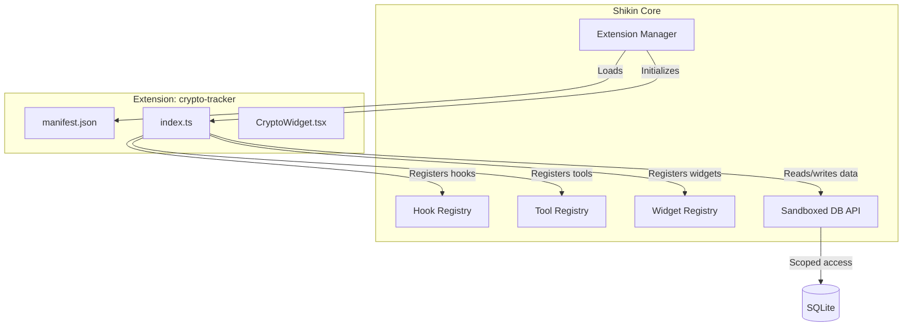
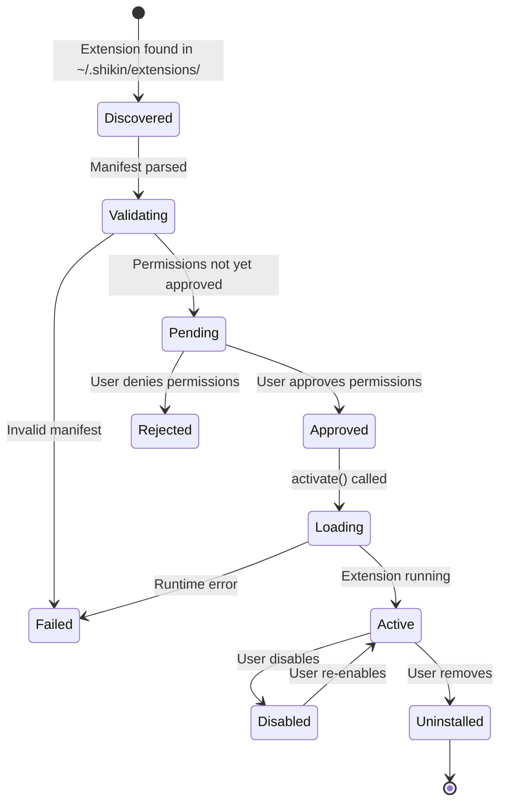

# Extension System

This document describes the design of Shikin's extension system, including the manifest format, permission model, hook points, data access API, and a complete example extension walkthrough.

**Status:** Planned for a future release. This document serves as the design specification.

---

## Overview

Shikin's extension system allows community developers to add features without modifying the core application. Extensions can:

- Add dashboard widgets for custom data visualizations.
- Add new navigation routes and pages.
- Add settings panels for extension configuration.
- React to application events (transactions created, budgets checked, etc.).
- Store and retrieve their own data in SQLite.

The design is inspired by VS Code's extension model and Obsidian's plugin system: sandboxed, permission-gated, and discoverable.

---

## Architecture



---

## Extension Directory

Extensions are installed in the Shikin app data directory:

```
~/.shikin/
├── extensions/
│   ├── crypto-tracker/
│   │   ├── manifest.json
│   │   ├── index.ts
│   │   └── components/
│   │       ├── CryptoWidget.tsx
│   │       └── Settings.tsx
│   └── tax-helper/
│       ├── manifest.json
│       └── index.ts
└── data/
    └── shikin.db
```

Each extension lives in its own directory under `extensions/`. The directory name must match the `id` field in the manifest.

---

## Manifest Format

Every extension requires a `manifest.json` file at its root.

```json
{
  "id": "crypto-tracker",
  "name": "Crypto Tracker",
  "version": "1.0.0",
  "description": "Track cryptocurrency holdings and live prices from CoinGecko.",
  "author": {
    "name": "Jane Developer",
    "url": "https://github.com/jane"
  },
  "license": "MIT",
  "repository": "https://github.com/jane/shikin-crypto-tracker",
  "minShikinVersion": "0.3.0",
  "main": "index.ts",
  "permissions": [
    "read:investments",
    "write:investments",
    "read:accounts",
    "read:extension_data",
    "write:extension_data",
    "network:api.coingecko.com"
  ],
  "tools": [
    {
      "name": "getCryptoPrice",
      "description": "Get the current price of a cryptocurrency"
    },
    {
      "name": "getCryptoPortfolio",
      "description": "Get a summary of all crypto holdings with live prices"
    }
  ],
  "hooks": ["afterTransaction", "onDashboardLoad"],
  "ui": {
    "dashboard_widget": {
      "component": "./components/CryptoWidget.tsx",
      "title": "Crypto Portfolio",
      "defaultWidth": 2,
      "defaultHeight": 1
    },
    "settings_panel": {
      "component": "./components/Settings.tsx",
      "title": "Crypto Tracker Settings"
    }
  }
}
```

### Manifest Fields

| Field              | Type     | Required | Description                                                                   |
| ------------------ | -------- | -------- | ----------------------------------------------------------------------------- |
| `id`               | string   | yes      | Unique identifier (kebab-case). Must match directory name.                    |
| `name`             | string   | yes      | Human-readable display name.                                                  |
| `version`          | string   | yes      | Semver version string.                                                        |
| `description`      | string   | yes      | Short description (under 200 characters).                                     |
| `author`           | object   | yes      | Author name and optional URL.                                                 |
| `license`          | string   | no       | SPDX license identifier.                                                      |
| `repository`       | string   | no       | Source code URL.                                                              |
| `minShikinVersion` | string   | no       | Minimum Shikin version required.                                              |
| `main`             | string   | yes      | Entry point file relative to extension directory.                             |
| `permissions`      | string[] | yes      | Required permissions (see Permission Model below).                            |
| `tools`            | object[] | no       | Automation actions this extension exposes. Each has `name` and `description`. |
| `hooks`            | string[] | no       | Application hooks this extension subscribes to.                               |
| `ui`               | object   | no       | UI components this extension provides.                                        |

---

## Permission Model

Extensions must declare all required permissions in their manifest. Users are shown the permission list when installing an extension and must approve them.

### Permission Format

```
<action>:<resource>
```

### Available Permissions

#### Data Access

| Permission                | Description                          |
| ------------------------- | ------------------------------------ |
| `read:accounts`           | Read account names, types, balances  |
| `write:accounts`          | Create or modify accounts            |
| `read:transactions`       | Read transaction history             |
| `write:transactions`      | Create, edit, or delete transactions |
| `read:categories`         | Read categories and subcategories    |
| `write:categories`        | Create or modify categories          |
| `read:budgets`            | Read budget definitions and status   |
| `write:budgets`           | Create or modify budgets             |
| `read:investments`        | Read investment holdings             |
| `write:investments`       | Create or modify investments         |
| `read:subscriptions`      | Read subscription data               |
| `write:subscriptions`     | Create or modify subscriptions       |
| `read:settings`           | Read app settings                    |
| `write:settings`          | Modify app settings                  |
| `read:extension_data`     | Read this extension's stored data    |
| `write:extension_data`    | Write to this extension's data store |
| `read:all_extension_data` | Read any extension's stored data     |

#### Network

| Permission         | Description                                                        |
| ------------------ | ------------------------------------------------------------------ |
| `network:<domain>` | Make HTTP requests to the specified domain                         |
| `network:*`        | Make HTTP requests to any domain (requires explicit user approval) |

#### UI

| Permission            | Description                               |
| --------------------- | ----------------------------------------- |
| `ui:dashboard_widget` | Add a widget to the dashboard             |
| `ui:settings_panel`   | Add a panel to the settings page          |
| `ui:navigation_route` | Add a new route to the sidebar navigation |
| `ui:notification`     | Show toast notifications                  |

### Permission Levels

Extensions are categorized by their permission scope:

| Level           | Criteria                                                       | User Experience                       |
| --------------- | -------------------------------------------------------------- | ------------------------------------- |
| **Low risk**    | Only `read:*` and `read:extension_data`/`write:extension_data` | Auto-approved with notice             |
| **Medium risk** | Any `write:*` permission                                       | Requires user approval                |
| **High risk**   | `network:*` or `write:settings`                                | Requires explicit opt-in with warning |

---

## Hook Points

Extensions can subscribe to application events by declaring hooks in their manifest and implementing handler functions.

### Available Hooks

#### Transaction Hooks

| Hook                | Trigger                                            | Data Provided                                                      | Can Modify?                                                                                       |
| ------------------- | -------------------------------------------------- | ------------------------------------------------------------------ | ------------------------------------------------------------------------------------------------- |
| `beforeTransaction` | Before a transaction is inserted into the database | Transaction data (amount, type, description, category, date, tags) | Yes -- can modify fields or reject the transaction by returning `{ reject: true, reason: "..." }` |
| `afterTransaction`  | After a transaction is committed                   | Complete transaction record with ID                                | No (read-only)                                                                                    |

#### Budget Hooks

| Hook                | Trigger                                       | Data Provided                                       |
| ------------------- | --------------------------------------------- | --------------------------------------------------- |
| `onBudgetCheck`     | When budget status is evaluated               | Budget record + current spending + remaining amount |
| `onBudgetThreshold` | When spending reaches 80% or 100% of a budget | Budget record + threshold percentage                |

#### Navigation Hooks

| Hook              | Trigger                               | Data Provided                                  |
| ----------------- | ------------------------------------- | ---------------------------------------------- |
| `onDashboardLoad` | When the dashboard page mounts        | Current account summaries, recent transactions |
| `onPageChange`    | When the user navigates to a new page | Route path                                     |

#### Lifecycle Hooks

| Hook                | Trigger                                   | Data Provided                    |
| ------------------- | ----------------------------------------- | -------------------------------- |
| `onExtensionLoad`   | When the extension is first loaded        | Extension config, Shikin version |
| `onExtensionUnload` | When the extension is disabled or removed | None                             |
| `onSettingsRender`  | When the settings page renders            | Current extension settings       |
| `onAppStart`        | When the Shikin application starts        | None                             |

### Hook Implementation

```typescript
// In the extension's index.ts
export default function activate(ctx: ExtensionContext) {
  ctx.hooks.on('afterTransaction', async (transaction) => {
    if (transaction.type === 'expense' && transaction.amount > 100_00) {
      ctx.ui.notify({
        title: 'Large expense detected',
        message: `$${(transaction.amount / 100).toFixed(2)} spent on ${transaction.description}`,
        type: 'warning',
      })
    }
  })

  ctx.hooks.on('beforeTransaction', async (transaction) => {
    // Example: auto-tag transactions based on description
    if (transaction.description.toLowerCase().includes('uber')) {
      return {
        ...transaction,
        tags: [...(transaction.tags || []), 'rideshare'],
      }
    }
    return transaction
  })
}
```

---

## Extension Context API

Every extension receives an `ExtensionContext` object when activated. This is the sandboxed API through which extensions interact with Shikin.

### ctx.data

Scoped key-value storage for the extension. Data is stored in the `extension_data` table, automatically namespaced to the extension's ID.

```typescript
interface ExtensionData {
  get(key: string): Promise<string | null>
  set(key: string, value: string): Promise<void>
  delete(key: string): Promise<void>
  list(): Promise<Array<{ key: string; value: string }>>
}
```

### ctx.db

Read-only or read-write access to Shikin's database tables, gated by the extension's declared permissions.

```typescript
interface ExtensionDB {
  // Only available if the extension has read permission for the table
  query<T>(table: AllowedTable, filters?: QueryFilters): Promise<T[]>

  // Only available if the extension has write permission for the table
  insert(table: AllowedTable, data: Record<string, unknown>): Promise<string>
  update(table: AllowedTable, id: string, data: Record<string, unknown>): Promise<void>
  delete(table: AllowedTable, id: string): Promise<void>
}
```

Raw SQL is not exposed to extensions. All queries go through the structured API, which enforces permission checks and prevents SQL injection.

### ctx.hooks

Subscribe to application events.

```typescript
interface ExtensionHooks {
  on(hook: HookName, handler: (data: HookData) => Promise<HookData | void>): void
  off(hook: HookName, handler: Function): void
}
```

### ctx.ui

Register UI components and show notifications.

```typescript
interface ExtensionUI {
  registerWidget(config: WidgetConfig): void
  registerSettingsPanel(config: SettingsPanelConfig): void
  registerRoute(config: RouteConfig): void
  notify(options: {
    title: string
    message: string
    type: 'info' | 'success' | 'warning' | 'error'
  }): void
}
```

### ctx.http

Make HTTP requests to permitted domains.

```typescript
interface ExtensionHTTP {
  fetch(url: string, options?: RequestInit): Promise<Response>
}
```

Only domains declared in the `network:` permissions are allowed. Requests to other domains throw a `PermissionDenied` error.

---

## Example Extension: Crypto Tracker

This walkthrough builds a complete extension that tracks cryptocurrency prices and adds a dashboard widget.

### Step 1: Create the directory

```
~/.shikin/extensions/crypto-tracker/
├── manifest.json
├── index.ts
└── components/
    ├── CryptoWidget.tsx
    └── Settings.tsx
```

### Step 2: Write the manifest

```json
{
  "id": "crypto-tracker",
  "name": "Crypto Tracker",
  "version": "1.0.0",
  "description": "Track cryptocurrency holdings with live CoinGecko prices.",
  "author": { "name": "Jane Developer" },
  "license": "MIT",
  "minShikinVersion": "0.3.0",
  "main": "index.ts",
  "permissions": [
    "read:investments",
    "write:extension_data",
    "read:extension_data",
    "network:api.coingecko.com",
    "ui:dashboard_widget",
    "ui:settings_panel",
    "ui:notification"
  ],
  "hooks": ["onDashboardLoad"],
  "ui": {
    "dashboard_widget": {
      "component": "./components/CryptoWidget.tsx",
      "title": "Crypto Portfolio",
      "defaultWidth": 2,
      "defaultHeight": 1
    },
    "settings_panel": {
      "component": "./components/Settings.tsx",
      "title": "Crypto Tracker"
    }
  }
}
```

### Step 3: Write the entry point

```typescript
// index.ts
import type { ExtensionContext } from '@shikin/extension-api'

const COINGECKO_API = 'https://api.coingecko.com/api/v3'

// Map common symbols to CoinGecko IDs
const SYMBOL_MAP: Record<string, string> = {
  BTC: 'bitcoin',
  ETH: 'ethereum',
  SOL: 'solana',
  ADA: 'cardano',
  DOT: 'polkadot',
}

export default function activate(ctx: ExtensionContext) {
  // Cache prices on dashboard load
  ctx.hooks.on('onDashboardLoad', async () => {
    try {
      const investments = await ctx.db.query('investments', {
        where: { type: 'crypto' },
      })

      if (investments.length === 0) return

      const symbols = investments.map((i: { symbol: string }) => i.symbol)
      const coinIds = symbols
        .map((s: string) => SYMBOL_MAP[s.toUpperCase()])
        .filter(Boolean)
        .join(',')

      const response = await ctx.http.fetch(
        `${COINGECKO_API}/simple/price?ids=${coinIds}&vs_currencies=usd`
      )
      const data = await response.json()

      await ctx.data.set(
        'cached_prices',
        JSON.stringify({
          data,
          timestamp: Date.now(),
        })
      )
    } catch (error) {
      console.error('Failed to fetch crypto prices:', error)
    }
  })
}
```

### Step 4: Write the dashboard widget

```tsx
// components/CryptoWidget.tsx
import { useEffect, useState } from 'react'
import type { ExtensionWidgetProps } from '@shikin/extension-api'

interface CryptoPrice {
  symbol: string
  price: number
  change24h: number
}

export default function CryptoWidget({ ctx }: ExtensionWidgetProps) {
  const [prices, setPrices] = useState<CryptoPrice[]>([])

  useEffect(() => {
    async function loadPrices() {
      const cached = await ctx.data.get('cached_prices')
      if (cached) {
        const { data } = JSON.parse(cached)
        const formatted = Object.entries(data).map(([id, priceData]: [string, any]) => ({
          symbol: id.toUpperCase(),
          price: priceData.usd,
          change24h: priceData.usd_24h_change || 0,
        }))
        setPrices(formatted)
      }
    }
    loadPrices()
  }, [ctx])

  return (
    <div className="space-y-2">
      {prices.map((p) => (
        <div key={p.symbol} className="flex items-center justify-between">
          <span className="font-medium">{p.symbol}</span>
          <div className="text-right">
            <div>${p.price.toLocaleString()}</div>
            <div className={p.change24h >= 0 ? 'text-green-500' : 'text-red-500'}>
              {p.change24h >= 0 ? '+' : ''}
              {p.change24h.toFixed(2)}%
            </div>
          </div>
        </div>
      ))}
      {prices.length === 0 && (
        <p className="text-muted-foreground text-sm">No crypto investments found.</p>
      )}
    </div>
  )
}
```

### Step 5: Write the settings panel

```tsx
// components/Settings.tsx
import { useState, useEffect } from 'react'
import type { ExtensionSettingsProps } from '@shikin/extension-api'

export default function Settings({ ctx }: ExtensionSettingsProps) {
  const [refreshInterval, setRefreshInterval] = useState('15')

  useEffect(() => {
    async function load() {
      const interval = await ctx.data.get('refresh_interval')
      if (interval) setRefreshInterval(interval)
    }
    load()
  }, [ctx])

  const handleSave = async () => {
    await ctx.data.set('refresh_interval', refreshInterval)
    ctx.ui.notify({
      title: 'Settings saved',
      message: 'Crypto tracker settings updated.',
      type: 'success',
    })
  }

  return (
    <div className="space-y-4">
      <div>
        <label className="text-sm font-medium">Price refresh interval (minutes)</label>
        <input
          type="number"
          value={refreshInterval}
          onChange={(e) => setRefreshInterval(e.target.value)}
          className="glass-input mt-1 w-full px-3 py-2"
          min="5"
          max="60"
        />
      </div>
      <button onClick={handleSave} className="bg-primary text-primary-foreground rounded px-4 py-2">
        Save
      </button>
    </div>
  )
}
```

---

## Extension Lifecycle



1. **Discovery** -- On startup, Shikin scans `~/.shikin/extensions/` for directories containing a `manifest.json`.
2. **Validation** -- The manifest is parsed and validated. Required fields are checked, version compatibility is verified.
3. **Permission Approval** -- New extensions (or extensions with changed permissions) require user approval.
4. **Activation** -- The extension's `main` file is loaded and its default export function is called with the `ExtensionContext`.
5. **Runtime** -- The extension receives hook events and responds to tool calls.
6. **Deactivation** -- When disabled or removed, the `onExtensionUnload` hook fires and all registered handlers are cleaned up.

---

## Security Considerations

1. **No raw SQL** -- Extensions cannot execute arbitrary SQL. All database access goes through the structured `ctx.db` API.
2. **Permission enforcement** -- Every `ctx.db` call checks the extension's declared permissions. Accessing a table without the right permission throws `PermissionDenied`.
3. **Network sandboxing** -- `ctx.http.fetch` only allows requests to domains listed in `network:` permissions.
4. **Data isolation** -- `ctx.data` is scoped to the extension's own `extension_id` in the `extension_data` table. Extensions cannot access other extensions' data unless they have `read:all_extension_data`.
5. **UI sandboxing** -- Extension UI components render in isolated containers. They cannot access the main application's React context or state stores directly.
6. **Version pinning** -- Extensions declare `minShikinVersion` to prevent running on incompatible versions.
